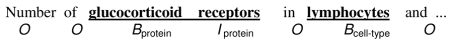
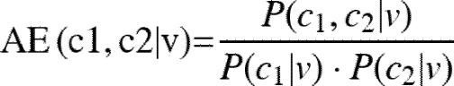
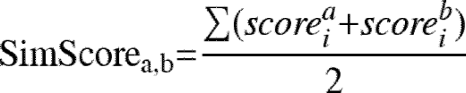
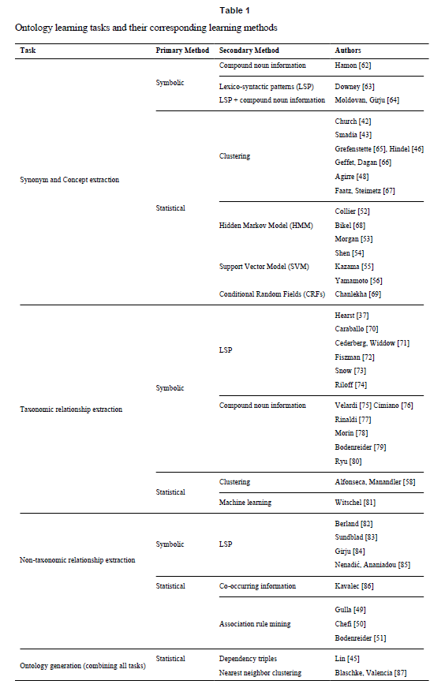
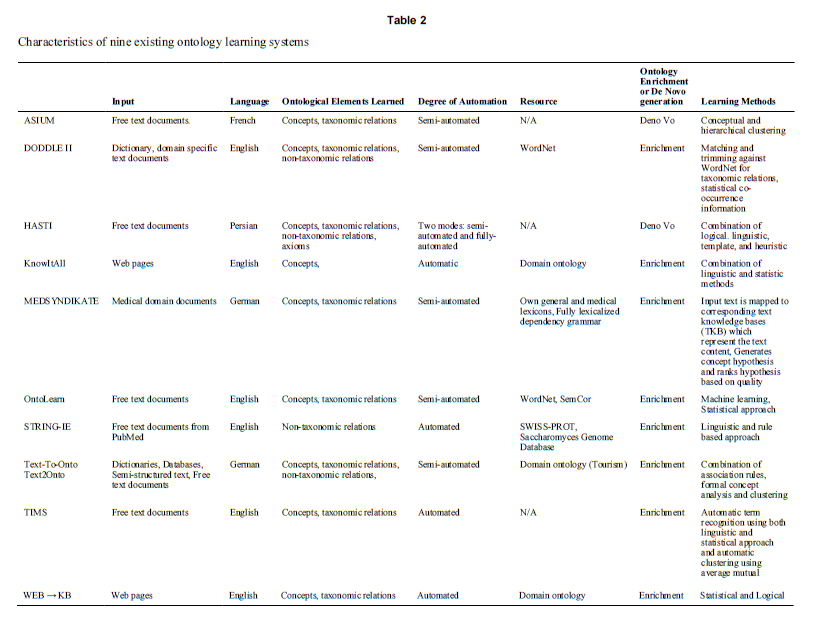

# Natural Language Processing Methods and Systems for Biomedical Ontology Learning
## Abstract
While the biomedical informatics community widely acknowledges the utility of domain ontologies, there remain many barriers to their effective use. One important requirement of domain ontologies is that they must achieve a high degree of coverage of the domain concepts and concept relationships. However, the development of these ontologies is typically a manual, time consuming, and often error-prone process. Limited resources result in missing concepts and relationships as well as difficulty in updating the ontology as knowledge changes. Methodologies developed in the fields of natural language processing, information extraction, information retrieval and machine learning provide techniques for automating the enrichment of an ontology from free-text documents. In this article, we review existing methodologies and developed systems, and discuss how existing methods can benefit the development of biomedical ontologies.

생의학 정보학 커뮤니티는 도메인 온톨로지의 유용성을 널리 인정하고 있지만 효과적인 사용에는 많은 장벽이 남아 있습니다. 도메인 온톨로지의 중요한 요구 사항 중 하나는 도메인 개념과 개념 관계에 대해 높은 수준의 적용 범위를 달성해야한다는 것입니다. 그러나 이러한 온톨로지의 개발은 일반적으로 수동적이고 시간 소모적이며 종종 오류가 발생하기 쉬운 프로세스입니다. 제한된 자원으로 인하여 개념과 관계가 누락되고 지식이 변화함에 따라 온톨로지를 업데이트하는 데 어려움이 있습니다. 자연어 처리, 정보 추출, 정보 검색 및 머신 러닝 분야에서 개발 된 방법론은 자유 텍스트 문서에서 온톨로지 강화를 자동화하는 기술을 제공합니다. 이 논문에서는 기존 방법론과 개발된 시스템을 검토하고 기존 방법이 생물 의학 온톨로지 개발에 어떻게 도움이되는지 논의합니다.

## 1. Background

### 1.1 Knowledge Resources used in Natural Language Processing

Natural Language Processing (NLP) and text mining are research fields aimed at exploiting rich knowledge resources with the goal of understanding, extraction and retrieval from unstructured text. Knowledge resources that have been used for these purposes include the entire range of terminologies, including lexicons, controlled vocabularies, thesauri, and ontologies. For the purposes of this description we follow the framework for describing terminologies and terminological systems defined by de Keizer [1,2] and Cornet [3]. The authors define concepts as “cognitive constructs” of objects that are built using the “characteristics of the objects”, terms as “language labels” for concepts, and synonyms as two or more terms that designate “a unique concept.”

NLP (Natural Language Processing) 및 텍스트 마이닝은 구조화되지 않은 텍스트의 이해, 추출 및 검색을 목표로 풍부한 지식 자원을 활용하기위한 연구 분야입니다. 이러한 목적으로 사용 된 지식 자료에는 어휘, 통제 어휘, 동의어 및 온톨로지를 포함한 모든 범위의 용어가 포함됩니다. 이 설명의 목적을 위해 우리는 de Keizer [1,2] 및 Cornet [3]에 의해 정의 된 용어 및 용어 시스템을 설명하기위한 프레임 워크를 따릅니다. 저자는 개념을“개체의 특성”, 개념을위한“언어 레이블”, 용어를“고유 한 개념”을 나타내는 두 개 이상의 용어로 사용하여 구축 된 개체의“인지 적 구성”으로 정의합니다.

For simple NLP tasks, such as named entity recognition, almost any type of terminology can be used. Slightly more complex tasks such as identification of concepts, requires the representation of synonyms, and therefore limits the resources to terminological systems such as controlled vocabularies and ontologies that encode multiple lexical representations in natural language [4]. For example, “liver cell” and “hepatocyte” would be represented in the vocabulary or ontology as synonyms, and therefore during NER they would be classified as the same concept.

명명된 엔터티 인식과 같은 간단한 NLP 작업의 경우 거의 모든 유형의 용어를 사용할 수 있습니다. 개념 식별과 같이 약간 더 복잡한 작업은 동의어 표현이 필요하므로 자원을 자연어로 여러 어휘 표현을 인코딩하는 제어 어휘 및 온톨로지와 같은 용어 시스템으로 제한합니다 [4]. 예를 들어, "간 세포"및 "간세포"는 어휘 또는 온톨로지에서 동의어로 표시되므로 NER 동안 동일한 개념으로 분류됩니다.

In contrast, some NLP tasks require more complex relationships between concepts, and therefore limit the types of terminological systems that may be used. Examples include word sense disambiguation [5], co-reference resolution [6–8], and discourse reasoning and extraction of attributes and values [9]. For example, if “hepatocellular carcinoma” and “liver neoplasm” are both used in a document to refer to the same entity, then these terms can be determined to co-refer if a relationship is represented in the terminology [10].

반대로, 일부 NLP 작업은 개념간에 보다 복잡한 관계를 요구하므로 사용할 수있는 용어 시스템의 유형을 제한합니다. 예를 들면 단어 감각 명확화 [5], 공동 참조 해결 [6–8], 속성 및 값의 담론 추론 및 추출 [9]이 있습니다. 예를 들어, 문서에서 "간세포 암종"과 "간 신생물"을 모두 동일한 개체를 지칭하기 위해 사용하는 경우, 용어가 관계로 표현되어 있으면 이러한 용어를 함께 참조하도록 결정할 수 있습니다 [10].

Ontologies can be used to make even more complex inferences and to derive rules necessary for semantic interpretation [11,12] and question and answering systems [13]. For this reason, ontologies have been of particular interest to researchers developing NLP systems. For example, to answer the question: “What role do infectious organisms play in liver cancer?” an ontology can be used to perform the query expansion and retrieve related textual information, if it contains the following information: 1) a synonym relationship between ‘liver cancer’ and ‘hepatocellular carcinoma’, 2) a hierarchical relationship between various hepatitis viruses and ‘infectious organism’, 3) an etiologic relationship between hepatitis viruses and hepatocellular carcinoma.

온톨로지는 더 복잡한 추론을 만들고 의미 해석에 필요한 규칙을 도출하기 위해 사용될 수있다 [11,12] 및 질문 및 답변 시스템 [13]. 이러한 이유로 온톨로지는 NLP 시스템을 개발하는 연구자들에게 특히 관심의 대상이되었습니다. 예를 들어,“감염성 유기체가 간암에서 어떤 역할을합니까?”라는 질문에 대답하기 위해 온톨로지를 사용하여 다음 정보가 포함 된 경우 쿼리 확장을 수행하고 관련 텍스트 정보를 검색 할 수 있습니다. 1) ' 간암 '과'간세포 암종 ', 2) 다양한 간염 바이러스와'감염성 유기체 '의 계층 적 관계, 3) 간염 바이러스와 간세포 암종 사이의 병 인적 관계.

### 1.2. Ontologies and Ontology Development

Researchers define ‘ontology’ in different ways [14–17], but these definitions have in common that an ontology is a representation of entities and their relationships in a particular domain, debates to whether the ‘entities’ represented are concepts [18] or real-world things [19] notwithstanding. A key requirement is that each entity has one unique reference in the ontology, typically a meaningless identifier to avoid confusion among natural language terms. Each identifier is linked to at least one natural language term, and often to greater than one natural language term to capture the synonymy inherent in human language. A standard ontology facilitates aggregation of data from multiple sources if each source uses the identifiers from the ontology. Interoperability is one of the primary—if not the primary—reason that groups have been engaged in the development of ontologies.

연구자들은 '온톨로지'를 다른 방식으로 정의하지만 [14-17], 이러한 정의는 온톨로지가 특정 영역에서 엔티티와 그들의 관계를 표현한다는 공통점을 가지고 있으며, 대표되는 '엔티티'가 개념인지 [18]  또는 실제적인 것들 [19]인지에 대한 논쟁입니다. 핵심 요건은 각 엔티티가 온톨로지에서 하나의 고유 한 참조를 가져야한다는 것입니다. 일반적으로 자연어 용어 간의 혼동을 피하기 위해 의미가없는 식별자입니다. 각각의 식별자는 인간 언어에 내재 된 동의어를 포착하기 위해 적어도 하나의 자연 언어 용어, 종종 하나 이상의 자연 언어 용어에 연결된다. 표준 온톨로지는 각 소스가 온톨로지의 식별자를 사용하는 경우 여러 소스의 데이터 집계를 용이하게합니다. 상호 운용성은 기본 중 하나입니다 (기본이 아닌 경우) -그룹이 온톨로지 개발에 참여한 이유.

Ontology developers usually capture the relationships among entities as formal, logical relationships. To do so, they frequently use one out of a family of logics known as description logics. Description logics constitute a family of fragments of first-order logic (nearly all of which are decidable), in which members of this family are primarily differentiated based on the set of allowed logical operators (for example, some exclude negation and universal quantification), which in turn determines the computational complexity of inference with the language. The Web Ontology Language (OWL) is a standard ontology language that captures the semantics of many description-logic languages.

온톨로지 개발자는 일반적으로 엔티티 간의 관계를 공식적이고 논리적 인 관계로 캡처합니다. 그렇게하기 위해, 그들은 종종 설명 논리 (description logics)로 알려진 논리 계열 중 하나를 사용합니다. 설명 논리는 1 차 논리 (거의 거의 모두 결정 가능)의 프래그먼트 패밀리를 구성하며,이 패밀리의 멤버는 주로 허용 된 논리 연산자 세트 (예 : 일부 제외 및 범용 정량화 제외)를 기반으로 차별화됩니다. 이는 언어와의 추론의 계산 복잡성을 결정합니다. OWL (Web Ontology Language)은 많은 설명 논리 언어의 의미를 캡처하는 표준 온톨로지 언어입니다.

A key consideration for NLP is that an ontology be complete with respect to the entities represented as well as their relationships and natural-language synonyms. To return to our example, to retrieve documents that discuss hepatocellular carcinoma, an NLP system requires an ontology that has an identifier for hepatocellular carcinoma, links from that identifier to the natural language terms ‘hepatocellular carcinoma’, ‘liver cancer’, “HCC”, etc, and relationships of that identifier to identifiers for other entities, such as hepatocellular carcinoma is_a liver neoplasm. It follows that when an ontology lacks a representation of an entity, a particular term for it, or some of its particular relationships, the quality of NLP based solely on that ontology will suffer. Lack of any representation of an entity inhibits detection of that entity. Lack of a synonym prevents recognition of the entity when a document uses the synonym to refer to it. Lack of a relationship might prevent finding answers to such questions as *What role do infectious organisms play in liver cancer?*

NLP에 대한 주요 고려 사항은 표현 된 엔티티와 관계 및 자연 언어 동의어와 관련하여 온톨로지를 완성해야한다는 것입니다. 우리의 예로 돌아가서 간세포 암종에 대해 설명하는 문서를 검색하려면 NLP 시스템에는 간세포 암종에 대한 식별자가있는 온톨로지가 필요합니다.이 식별자와 자연어 용어 '간세포 암종', '간암', 'HCC' 등, 및 간세포 암종과 같은 다른 개체에 대한 식별자와 그 식별자의 관계는 간 신생물이다. 온톨로지가 실체의 표현, 실체에 대한 특정 용어 또는 특정 관계의 일부가 없을 때, 온톨로지에 기초한 NLP의 질은 나삐질 것이다. 엔티티의 표현이 부족하면 해당 엔티티의 감지가 금지됩니다. 동의어가 없으면 문서가 동의어를 사용하여 참조 할 때 엔티티를 인식하지 못합니다. 관계가 없으면 *감염성 유기체가 간암에서 어떤 역할을 하는가*와 같은 질문에 대한 답을 찾지 못할 수 있습니다.

At present, the process of ontology development is largely manual. Humans must add identifiers and their synonyms and relationships one by one. The investment in ontology development is huge. The National Human Genome Research Institute has funded the Gene Ontology (GO) Consortium since 2001 [20], when the GO was already enjoying widespread success. In 2009, this funding was $3.4 million plus a $1 million supplement [20]. In 2005, the National Center for Biomedical Ontology (NCBO) received $18.8 million over 5 years [21]. An effort to build the infectious disease ontology just received $1.25 million over four years [22]. The National Science Foundation recently invested >$900,000 over two years in an ontology of Hymenoptera [23]. The National Library of Medicine has paid approximately $6 million per year for the ongoing development of SNOMED-CT since 2007 [24], after an initial investment of $32.4 million in 2003 [25].

현재 온톨로지 개발 프로세스는 대부분 수동입니다. 인간은 식별자와 동의어 및 관계를 하나씩 추가해야합니다. 온톨로지 개발에 대한 투자는 엄청납니다. National Human Genome Research Institute는 GO가 이미 널리 성공한 2001 년 이후 유전자 온톨로지 (GO) 컨소시엄에 자금을 지원했다 [20]. 2009 년에이 자금은 340 만 달러에 100 만 달러의 보조금이 추가되었습니다 [20]. 2005 년에 국립 보건 의학 온톨로지 (NCBO)는 5 년에 걸쳐 1881 만 달러를 받았다 [21]. 전염병 온톨로지를 구축하려는 노력은 4 년 동안 1,25 백만 달러를 받았다 [22]. National Science Foundation은 최근 2 년 동안 Hymenoptera의 온톨로지에 9 백만 달러 이상을 투자했습니다 [23]. 국립 의학 도서관 (National Library of Medicine)은 2007 년부터 SNOMED-CT의 지속적인 개발에 대해 매년 약 6 백만 달러를 지불했다 [24].

One approach to facilitating this manual process is to use informatics tools to accelerate the interactions among domain experts and ontologists necessary to the ontology development process. An important recent development is the NCBO’s BioPotal. BioPortal enables the biomedical community to find, comment on, and contribute to biomedical ontologies,
thereby facilitating interactions among ontology users and developers to increase the value of the ontologies [26]. Stanford has developed Collaborative Protégé to allow collaborative ontology development in real time by users in different locations [27]. The earliest examples of such technologies date to the mid-1990s with work done by Campbell et al. to facilitate geographically-distributed development of SNOMED-RT and its successor SNOMED-CT [28].

이 수동 프로세스를 용이하게하는 한 가지 방법은 정보학 도구를 사용하여 온톨로지 개발 프로세스에 필요한 도메인 전문가와 온톨로지 사이의 상호 작용을 가속화하는 것입니다. 중요한 최근 개발은 NCBO의 BioPotal입니다. BioPortal은 생물 의학 커뮤니티가 생물 의학 온톨로지를 찾고, 의견을 작성하고, 기여할 수 있도록합니다. 온톨로지 사용자와 개발자 간의 상호 작용을 촉진하여 온톨로지의 가치를 높이는 것 [26]. Stanford는 다양한 위치의 사용자가 실시간으로 협업 온톨로지를 개발할 수 있도록 Collaborative Protégé를 개발했습니다 [27]. 이러한 기술의 초기 사례는 1990 년대 중반에 SNOMED-RT와 그 후속 SNOMED-CT의 지리적으로 분산 된 개발을 촉진하기 위해 Campbell 등이 수행 한 작업으로 시작되었습니다 [28].

Another approach to reducing resources required is division of labor. Put simply, the goal is to avoid the wastefulness of recreating multiple representations of the same entity (and its synonyms and relationships) in multiple ontologies, which results in multiple identifiers for entities, one per ontology. The OBO Foundry seeks to avoid this problem and thereby facilitate ontology development by mandating orthogonality of ontologies. That is, it has a well-defined goal of having only one representation of an entity in all of the ontologies in the Foundry [29]. Already, per Smith et al., this principle has resulted in the consolidation of several ontologies [29]. This approach also has the goal of increasing interoperability by avoiding the necessity for ‘mapping’ identifiers among ontologies that represent the same entities (i.e., asserting that identifiers from multiple ontologies refer to the same entity).

필요한 자원을 줄이는 또 다른 방법은 분업입니다. 간단히 말해, 목표는 여러 온톨로지에서 동일한 엔터티 (및 그 동의어 및 관계)의 여러 표현을 다시 생성하여 온톨로지 당 하나씩 엔터티에 대한 여러 식별자를 생성하는 낭비를 피하는 것입니다. OBO 파운드리는이 문제를 피하고 온톨로지의 직교성을 요구함으로써 온톨로지 개발을 촉진하고자합니다. 즉, 그것은 파운드리 [29]의 모든 온톨로지에서 하나의 실체를 하나만 나타내는 목표를 잘 정의하고있다. 스미스 (Smith) 등에 의해 이미이 원칙은 여러 온톨로지의 통합을 가져왔습니다 [29]. 이 접근법은 또한 동일한 엔티티를 나타내는 온톨로지간에 식별자를 '매핑 (mapping)'할 필요성을 피함으로써 상호 운용성을 높이는 목표를 가지고있습니다(즉, 여러 온톨로지의 식별자가 동일한 엔티티를 참조한다고 주장합니다).

Lastly, there is a large body of research on automating the development and maintenance of ontologies using NLP. Because literature and text documents are major mechanisms for reporting new knowledge about a domain, ontological knowledge is often stated explicitly or implicitly within the text, and these reference documents serve as important knowledge-rich resources for ontology learning. As NLP often uses ontological knowledge to interpret the texts (see section 1.1), NLP can also help to enrich and enhance the linguistic realization of ontology. Therefore, many researchers have been utilizing methods from fields of NLP, computational linguistics (CL) and artificial intelligence (AI) to partially or fully automate semantic knowledge extraction. This approach has been termed “ontology learning”, and represents a sub-field of Knowledge Acquisition (KA). The goal of this paper is to survey these methods.

마지막으로 NLP를 사용하여 온톨로지의 개발 및 유지 보수를 자동화하는 것에 대한 많은 연구가 진행되고 있습니다. 문헌과 텍스트 문서는 도메인에 대한 새로운 지식을보고하는 주요 메커니즘이기 때문에, 온톨로지 지식은 종종 텍스트 내에 명시 적 또는 암시 적으로 언급되며, 이러한 참조 문서는 온톨로지 학습을위한 중요한 지식이 풍부한 자원으로 작용합니다. NLP는 종종 텍스트를 해석하기 위해 온톨로지 지식을 사용하기 때문에 (1.1 절 참조) NLP는 온톨로지의 언어 적 실현을 풍부하게하고 향상시키는 데 도움이 될 수 있습니다. 따라서 많은 연구자들이 시맨틱 지식 추출을 부분적으로 또는 완전히 자동화하기 위해 NLP, 전산 언어학 (CL) 및 인공 지능 (AI) 분야의 방법을 사용하고 있습니다. 이 접근 방식은 "온톨로지 학습"이라고하며, 지식 획득 (KA)의 하위 필드를 나타냅니다. 이 논문의 목표는 이러한 방법을 조사하는 것입니다.

### 1.3. Ontology Learning and Ontology Learning Tasks

Knowledge Acquisition (KA) is a broad field that encompasses the processes of extracting, creating, structuring knowledge from heterogeneous resources, including experts [30]. Semiautomated and automated approaches to KA utilize data that may be derived from structured, semi-structured, or unstructured data sources, and may result in knowledge representations of many different types [31]. Ontology learning (OL), however, is limited to the extraction of ontological elements from knowledge-rich resources. A further delineation is made for ontology learning from text, which builds on a large body of work within the fields of NLP, CL and AI [32,33]. In biomedicine, text resources for ontology learning from text include the scientific literature and clinical documents, many of which are already available in electronic format. Finally, ontology learning from text can be further subdivided by task based on the ontological element that is learned from the resources [32]. These tasks include term extraction, synonym extraction, concept extraction (both taxonomic and nontaxonomic), relationship extraction and axiom extraction (an axiom is defined as a rule that is used to constrain the information in an ontology).

KA (Knowledge Acquisition)는 전문가를 포함하여 이기종 리소스에서 지식을 추출, 생성, 구조화하는 프로세스를 포함하는 광범위한 분야입니다 [30]. KA에 대한 반자동 및 자동 접근 방식은 구조화, 반 구조화 또는 비 구조화 데이터 소스에서 파생 될 수있는 데이터를 활용하며 다양한 유형의 지식 표현이 가능합니다 [31]. 그러나 온톨로지 학습 (OL)은 지식이 풍부한 자원에서 존재론적 요소를 추출하는 것으로 제한됩니다. 텍스트를 통한 온톨로지 학습에 대한 추가 설명이 있으며, 이는 NLP, CL 및 AI 분야 내에서 많은 작업을 수행한다 [32,33]. 생물 의학에서, 텍스트로부터 온톨로지 학습을위한 텍스트 자원은 과학 문헌 및 임상 문서를 포함하며, 이들 중 다수는 이미 전자 형식으로 이용 가능하다. 마지막으로, 텍스트로부터 온톨로지 학습은 자원으로부터 학습 된 온톨로지 요소에 기초하여 작업에 의해 더 세분화 될 수있다 [32]. 이러한 작업에는 용어 추출, 동의어 추출, 개념 추출 (분류학 및 비 분류학), 관계 추출 및 공리 추출 (공리가 온톨로지의 정보를 제한하는 데 사용되는 규칙으로 정의 됨)이 포함됩니다.

The purpose of this paper is to review research on ontology learning from text, both within and outside of biomedical informatics. Because the potential breadth of this review is very large, we have made the following decisions and definitions in limiting our scope:

이 논문의 목적은 생체 의학 정보학의 내외부에서 텍스트를 통한 온톨로지 학습에 관한 연구를 검토하는 것입니다. 이 검토의 폭이 매우 크기 때문에 범위를 제한 할 때 다음과 같은 결정 및 정의를 내 렸습니다.

1. Although there continues to be dissent over whether instances (individuals) should be included in biomedical ontologies at all, many NLP tasks including information extraction, co-reference resolution and question answering cannot be accomplished without knowledge of instances and their relationship to the corresponding ontology classes. Many researchers in KA and OL consider learning of new ontology instances to be part of ontology learning [32], as it can be encompassed by some combination of term extraction, synonym extraction and concept extraction, depending on how knowledge is modeled in the ontology. For these reasons, we choose to define instance learning as a task of ontology learning in this review. We recognize that this task may not be relevant to all ontology engineering efforts.

   실체 (개체)가 생체 의학 온톨로지에 포함되어야하는지에 대해서는 여전히 의견이 분분하지만, 정보 추출, 상호 참조 해결 및 질문 답변을 포함한 많은 NLP 과제는 실례와 해당 온톨로지 클래스와의 관계 없이는 달성 될 수 없다 . KA와 OL의 많은 연구원들은 온톨로지에서 지식이 모델링되는 방식에 따라 용어 추출, 동의어 추출 및 개념 추출의 일부 조합으로 포괄 될 수 있으므로 새로운 온톨로지 인스턴스에 대한 학습을 온톨로지 학습의 일부로 간주합니다 [32]. 이러한 이유로 우리는이 학습에서 인스턴스 학습을 온톨로지 학습의 작업으로 정의하기로 선택합니다. 우리는이 작업이 모든 온톨로지 엔지니어링 노력과 관련이 없을 수도 있음을 알고 있습니다.

2. As we have previously described, the broader field of KA includes research that is easily applied to some of these tasks (particularly term and synonym extraction). Therefore, for these tasks we have not strictly limited our review to those methods that could be labeled as “ontology learning”. For a more complete treatment of the general field of KA, and automated approaches, the reader is referred to recent review articles and book chapters [30,34–36].

   앞에서 설명한 것처럼 KA의 광범위한 분야에는 이러한 작업 중 일부 (특히 용어 및 동의어 추출)에 쉽게 적용되는 연구가 포함됩니다. 따라서 이러한 작업에 대해 검토를 "온톨로지 학습"으로 분류 할 수있는 방법으로 엄격하게 제한하지 않았습니다. KA의 일반적인 분야와 자동화 된 접근 방식에 대한보다 완벽한 처리를 위해 독자는 최근 검토 기사 및 서적 장을 참조합니다 [30,34–36].

3. We have chosen to exclude axiom learning from the ontology learning tasks reviewed, because there has been so little relevant work in this area.

   우리는이 분야에서 관련 연구가 거의 없었기 때문에 검토 된 온톨로지 학습 과제에서 공리 학습을 제외하기로 선택했습니다.

### 1.4. NLP approaches to ontology learning

For the past several decades, fields of studies such as computational linguistics, NLP, machine learning (ML), and AI have developed methods and algorithms for information retrieval and extraction from free-text knowledge resources. Some of these methods have been used and tested for ontology learning from text and have shown promising results. In general, these methods can be categorized into symbolic, statistical, and hybrid approaches (Table 1). The symbolic approach utilizes linguistic information to extract information from text. For example, noun phrases are considered to be lexicalized concepts and are often used to represent concepts in an ontology. Linguistic rules describing the relationships between terms in the text can also be used to identify conceptual relationships within an ontology. The most common symbolic approach is to use lexico-syntactic pattern (LSP) matching, which was first explored by Hearst [37]. LSPs are surface relational markers that exist in a natural language. For example, in the phrase "systemic granulomatous diseases such as Crohn’s disease or sarcoidosis” the words “such as” can help us infer that “systemic granulomatous diseases” is a hypernym of “Crohn’s disease” and “sarcoidosis”. Another symbolic approach is to use the internal syntactic structure of component terms. Concepts are often represented using compound, multi-word terms. In general, a compound term is more specific than a single compositional term. The basis of this method is the assumption that a compound term is likely a hyponym of a single term. For example, using this approach the term “prostatic carcinoma” can be considered to be a hyponym of “carcinoma”. It is also possible to use multiple symbolic approaches at the same time, for example the LSP method can be used with information from compound terms. 

지난 수십 년 동안 컴퓨터 언어학, NLP, 기계 학습 (ML) 및 AI와 같은 연구 분야는 자유 텍스트 지식 리소스에서 정보를 검색하고 추출하기위한 방법과 알고리즘을 개발했습니다. 이러한 방법 중 일부는 텍스트를 통한 온톨로지 학습에 사용 및 테스트되었으며 유망한 결과를 보여주었습니다. 일반적으로 이러한 방법은 기호, 통계 및 하이브리드 방식으로 분류 할 수 있습니다 (표 1). 상징적 접근 방식은 언어 정보를 사용하여 텍스트에서 정보를 추출합니다. 예를 들어, 명사구는 어휘 화 된 개념으로 간주되며 온톨로지에서 개념을 나타내는 데 종종 사용됩니다. 텍스트에서 용어 간의 관계를 설명하는 언어 규칙을 사용하여 온톨로지 내에서 개념적 관계를 식별 할 수 있습니다. 가장 일반적인 상징적 접근은 Hearst [37]에 의해 처음 탐색 된 LSP (lexico-syntactic pattern) 매칭을 사용하는 것이다. LSP는 자연 언어로 존재하는 표면 관계형 마커입니다. 예를 들어, "크론 병 또는 유육종증과 같은 전신 육아 종성 질환"이라는 어구에서 "예를 들어"라는 단어는 "전신성 육아 종성 질환"이 "크론 병"및 "유육종증"의 동의어임을 암시하는 데 도움이 될 수 있습니다. 구성 요소 용어의 내부 구문 구조를 사용합니다. 개념은 종종 복합 단어 용어를 사용하여 표현됩니다. 일반적으로 복합 용어는 단일 구성 용어보다 더 구체적입니다.이 방법의 기초는 복합 용어가 예를 들어,이 방법을 사용하는 경우 "전립선 암종"이라는 용어는 "암종"의 hyponym으로 간주 될 수 있으며 LSP와 같이 여러 개의 상징적 접근법을 동시에 사용할 수도 있습니다. 방법은 복합 용어의 정보와 함께 사용할 수 있습니다.

The statistical approach uses large corpora of text data, so this approach has also been characterized as the “corpus-based approach”. Harris [38] popularized this approach with his distributional hypothesis, advancing Firth’s notion that “a word is characterized by the company it keeps” [39]. Building on Harris’s theory, it became common practice to classify words not only on the basis of their meaning, but also on the basis of their co-occurrence with other words. The advantage of this method is that it requires minimal prior knowledge and can be generalized to other domains. However, for reliable information to be obtained, a large corpus of text is needed. Statistical techniques often utilize different linguistic principles and features for statistical measurements to extract semantic information. One of these linguistic principles is selectional restrictions [40], in which syntactic structures provide relevant information about semantic content.

통계적 접근 방식은 텍스트 데이터의 큰 코포라를 사용하므로이 접근 방식은 "코퍼스 기반 접근 방식"으로 특성화되었습니다. Harris [38]는 자신의 분포 가설을 통해이 접근 방식을 대중화하여“단어가 지키는 회사가 특징이다”라는 Firth의 개념을 발전시켰다 [39]. 해리스의 이론을 바탕으로 단어의 의미뿐만 아니라 다른 단어와의 동시 발생에 따라 단어를 분류하는 것이 일반적인 관행이되었습니다. 이 방법의 장점은 최소한의 사전 지식이 필요하고 다른 도메인으로 일반화 될 수 있다는 것입니다. 그러나 신뢰할 수 있는 정보를 얻으려면 많은 양의 텍스트가 필요합니다. 통계 기술은 종종 의미 정보를 추출하기 위해 통계 측정을 위해 다른 언어 원리와 기능을 사용합니다. 이러한 언어 적 원칙 중 하나는 선택 제한 [40]으로 구문 구조는 의미 론적 내용에 대한 관련 정보를 제공합니다.

Statistical methods can be categorized into two major categories: clustering approaches and machine learning methods. The clustering technique for extraction is based on a similarity measure, whereas the machine learning technique attempts to treat the knowledge extraction problem as a classification process. Clustering is useful for two purposes. First, the similarity measurements can provide information about the hierarchical relationships of concepts (relationship extraction). Second, the identification of distinct clusters of similar terms can help in identifying concepts and their synonyms.

통계 방법은 두 가지 주요 범주인 클러스터링 방법과 기계 학습 방법으로 분류 할 수 있습니다. 추출을위한 클러스터링 기술은 유사성 측정법을 기반으로하는 반면 머신 러닝 기술은 지식 추출 문제를 분류 프로세스로 처리하려고합니다. 클러스터링은 두 가지 목적에 유용합니다. 첫째, 유사성 측정은 개념의 계층 적 관계 (관계 추출)에 대한 정보를 제공 할 수 있습니다. 둘째, 유사한 용어의 별개의 군집을 식별하면 개념과 동의어를 식별하는 데 도움이 될 수 있습니다.

The extraction techniques for clustering similar terms are based on definitions of a context within a given corpus. In general, the context of the target word refers to the surrounding linguistic elements. However, the precise definition of context can vary somewhat depending on the scope. For example, the “first order word context” defined by Grefenstette [41], utilizes information only in the immediate vicinity of the target word [42,43]. In contrast, the “second order word context” utilizes syntactic information, such as nounmodifiers [44], dependency triples [45], verb-arguments [46], and preposition structures [41,47]. When utilizing second order context similarity to cluster similar words, we would expect semantically similar words to cluster even though they would not typically appear next to each other. For example, the synonyms ‘tumor’ and ‘tumour’ would cluster together because they are likely to appear in similar contexts, even though they would not be found together. The context can be further defined as the entire document. In this approach, concepts are represented by a vector of co-occurring terms within a set of domain-specific documents, as a concept signature [45,48]. Similarity between concepts can then be calculated by comparing concept signatures. Another approach that utilizes the context of the entire document is the association rule mining technique for concept relationship discovery [49–51].

유사한 용어를 군집화하기위한 추출 기술은 주어진 모음 내에서 문맥의 정의를 기반으로합니다. 일반적으로 대상 단어의 문맥은 주변 언어 요소를 나타냅니다. 그러나 컨텍스트의 정확한 정의는 범위에 따라 약간 다를 수 있습니다. 예를 들어, Grefenstette [41]에 의해 정의 된 "1 차 단어 문맥"은 대상 단어 [42,43] 바로 근처에서만 정보를 사용합니다. 대조적으로, "2 차 단어 문맥"은 명사 (ununmodifier) [44], 의존성 트리플 (dependency triples) [45], 동사-인수 [46] 및 전치사 구조 (preposition structure) [41,47]와 같은 구문 정보를 이용한다. 유사한 단어를 군집화하기 위해 2 차 문맥 유사성을 이용할 때, 일반적으로 서로 옆에 나타나지 않더라도 의미 론적으로 유사한 단어를 군집에 기대할 수 있습니다. 예를 들어 '종양'및 '종양'이라는 동의어는 함께 찾을 수는 없더라도 유사한 상황에 나타날 수 있기 때문에 함께 묶일 수 있습니다. 컨텍스트는 전체 문서로 추가 정의 될 수 있습니다. 이 접근법에서, 개념은 개념 서명으로서 도메인 특정 문서 세트 내에서 발생하는 용어의 벡터로 표현된다 [45,48]. 그런 다음 개념 서명을 비교하여 개념 간의 유사성을 계산할 수 있습니다. 전체 문서의 맥락을 활용하는 또 다른 접근법은 개념 관계 발견을위한 연관 규칙 마이닝 기법입니다 [49–51].

Although machine learning is the major approach used for many NLP tasks such as POS tagging, chunking and co-reference resolution, most applications of machine learning to ontology learning from text focus on the relatively simpler task of new concept identification and use supervised methods [52–56]. Using machine learning methods to identify the precise taxonomic location for a concept is a much more difficult task for fully automated systems [57–60].

기계 학습이 POS 태깅, 청킹 및 공동 참조 해결과 같은 많은 NLP 작업에 사용되는 주요 접근 방법이지만, 기계 학습의 대부분의 응용 프로그램은 텍스트에서 온톨로지 학습에 이르기까지 비교적 단순한 개념의 새로운 개념 식별 및 감독 방법을 사용합니다. –56]. 기계 학습 방법을 사용하여 개념의 정확한 분류 학적 위치를 식별하는 것은 완전 자동화 된 시스템에서 훨씬 더 어려운 작업입니다 [57–60].

Despite the widely accepted belief that statistical methods for ontology learning provide better coverage and scalability than symbolic methods, Basili [61] points out that statistical methods only provide a probability. The output is often represented by words, word strings or word clusters with associated probabilities. The conceptual explanation of the results is not provided. Ultimately, a human analyst must make sense of this data, because, at present, full automation seems unachievable. Therefore, many researchers have explored the potential of combining the statistical and the symbolic approaches for knowledge extraction.

온톨로지 학습을위한 통계적 방법이 상징적 방법보다 더 나은 적용 범위와 확장 성을 제공한다는 널리 받아 들여진 믿음에도 불구하고 Basili [61]는 통계적 방법은 단지 확률 만 제공한다고 지적했다. 출력은 종종 관련 확률이있는 단어, 단어 문자열 또는 단어 클러스터로 표시됩니다. 결과에 대한 개념적인 설명은 제공되지 않습니다. 궁극적으로, 인간 분석가는이 데이터를 이해해야합니다. 현재는 완전 자동화가 불가능하기 때문입니다. 따라서 많은 연구자들이 지식 추출을위한 통계적 접근법과 상징적 접근법을 결합 할 수있는 가능성을 탐색했습니다.

The remainder of this paper is organized as follows. First, we review the methods and algorithms that have been used for ontology learning (Section 3) categorized by ontology learning task and by approach (Table 1). For each of these categories, we review related papers that are prominent in the field of ontology learning, focusing on algorithmic methods, and describe the advantages and disadvantages of each method. Second, we provide examples of several state-of-the art systems that use these various approaches to support ontology learning from text (Section 4). Third, we discuss how these techniques could be used to develop more sophisticated methods and systems for biomedical ontology learning, as well as the barriers that may impede such progress (Section 5).

본 논문의 나머지 부분은 다음과 같이 구성되어있다. 먼저, 온톨로지 학습 과제와 접근법 (표 1)으로 분류 된 온톨로지 학습 (섹션 3)에 사용 된 방법과 알고리즘을 검토합니다. 이러한 각 범주에 대해 온톨로지 학습 분야에서 두드러진 관련 논문을 검토하고 알고리즘 방법에 중점을두고 각 방법의 장단점을 설명합니다. 둘째, 텍스트를 통한 온톨로지 학습을 지원하기 위해 이러한 다양한 접근 방식을 사용하는 여러 최신 시스템의 예를 제공합니다 (섹션 4). 셋째, 우리는 이러한 기술을 사용하여 생물 의학 온톨로지 학습을위한보다 정교한 방법과 시스템을 개발하는 방법과 그러한 진행을 방해 할 수있는 장벽에 대해 논의합니다 (5 장).

## 2. Retrieval and selection of articles considered in this review

Articles were retrieved using three approaches: (1) search of references across multiple WWW sources using the Google search engine (2) review of a recently published book containing chapters relevant to this subject, and (3) iterative review of related citations. 

논문들은 세가지 접근을 수행했다: (1) Google 검색 엔진을 사용하여 여러 WWW 소스에서 참조 검색 (2)이 주제와 관련된 장이 포함 된 최근에 출판 된 책 검토 및 (3) 관련 인용에 대한 반복 검토.

For the internet search, we used the key words “ontology learning from text”, “ontology enrichment”, and “NLP and Ontology development” to retrieve research articles from multiple sources. From all articles returned, we included articles relevant to the topic, with either high search engine ranking (presence within the first 100 items) or greater than 15 citations on CiteSeer. We also included articles cited in the book “Ontology learning from text: methods, evaluation and application” [32]. Finally, we iteratively reviewed citations from these sources to find other relevant articles, and then reviewed the references from the newly identified articles. Using this process, we read and considered a total of 343 articles, of which 150 are discussed in this review paper. Of these 150 articles, 51 are discussed in detail as exemplars of the various approaches.

인터넷 검색을 위해“텍스트를 통한 온톨로지 학습”,“온톨로지 강화”및“NLP 및 온톨로지 개발”이라는 키워드를 사용하여 여러 출처에서 연구 논문을 검색했습니다. 반환 된 모든 기사에서 주제와 관련된 기사를 포함 시켰으며, 검색 엔진 순위가 높거나 (최초 100 개 항목 내에 존재 함) CiteSeer에서 15 개 이상의 인용을 받았습니다. 또한“텍스트를 통한 온톨로지 학습 : 방법, 평가 및 적용”[32] 책에 인용 된 논문도 포함했습니다. 마지막으로, 우리는 이러한 출처에서 인용을 반복적으로 검토하여 다른 관련 기사를 찾은 다음 새로 식별 된 기사의 참조를 검토했습니다. 이 프로세스를 사용하여 총 343 개의 논문를 읽고 고려했으며이 중 150 개가이 검토 논문에서 논의되었습니다. 이들 150 개의 기사 중 51 개가 다양한 접근법의 예로서 상세하게 논의된다.

## 3. Research on ontology learning from text

We review approaches to ontology learning from text, based on their associated learning task: synonym and concept extraction (Section 3.1), taxonomic relationship extraction (Section 3.2), non-taxonomic relationship extraction (Section 3.3), and generation of ontologies de novo (Section 3.4). We consider the task of term extraction (instance extraction) to be encompassed by concept or synonym extraction, and it is therefore not separately considered. In many cases, a particular method can be used for more than one task, which is particularly common among the statistical methods. For the purposes of this review, we have classified each paper by the task that we consider most salient, and noted other tasks that may be accomplished when relevant. Because we focus on describing approaches and algorithms, we have further distinguished approaches that are primarily symbolic from those which are primarily statistical, and by primary methodology type (e.g. LSP, clustering), noting those cases in which the approaches overlap.

우리는 동의어와 개념 추출 (3.1 절), 분류학적 관계 추출 (3.2 절), 비분류학적 관계 추출 (3.1 절), 온톨로지 생성 (1 절)과 같은 관련 학습 과제를 바탕으로 텍스트에서 온톨로지 학습에 대한 접근 방식을 검토합니다. 섹션 3.4). 추출 (인스턴스 추출)이라는 용어는 개념 또는 동의어 추출에 포함되는 것으로 간주되므로 별도로 고려되지 않습니다. 많은 경우에, 특정 방법이 하나 이상의 작업에 사용될 수 있으며, 이는 특히 통계 방법 중에서 일반적입니다. 이 검토의 목적 상, 우리는 가장 두드러진 과제로 각 논문을 분류했으며 관련이있을 때 달성 할 수있는 다른 과제를 언급했습니다. 우리는 접근 방식과 알고리즘을 설명하는 데 중점을두기 때문에, 주로 통계적 접근 방식과 주요한 방법론 유형 (예 : LSP, 클러스터링)을 중심으로 접근 방식이 겹치는 경우를 고려하여 접근 방식이 더욱 차별화되었습니다.

### 3.1. Extraction of synonyms and concepts

Extraction of synonyms and concepts has been approached using a variety of methods. In many cases, a particular method cannot distinguish between these ontological elements. In other cases, a particular method that has been used for one of these tasks could easily be used for another learning task. Thus, we consider approaches in this category along a spectrum of complexity, starting with symbolic methods designed primarily to extract synonyms.

동의어 및 개념의 추출은 다양한 방법을 사용하여 접근되었습니다. 많은 경우에, 특정 방법은 이러한 존재론적 요소를 구별 할 수 없습니다. 다른 경우에는 이러한 작업 중 하나에 사용 된 특정 방법을 다른 학습 작업에 쉽게 사용할 수 있습니다. 따라서, 우리는 주로 동의어를 추출하도록 설계된 상징적 방법으로 시작하여 복잡한 범주에 따라이 범주의 접근법을 고려합니다.

#### 3.1.1. Symbolic Methods

Compound noun information provides a simple symbolic
method for synonym identification. Hamon et al. [62] used a general purpose thesaurus as the knowledge resource along with the following three heuristics: (1) IF two compound terms’ noun heads which are identical and have modifiers which are synonyms; or (2) IF two noun heads are synonyms and have modifiers which are identical; or (3) IF two noun heads are synonyms and have modifiers which are also synonyms, THEN the two compound terms are synonyms. Using a biomedical example, the terms “hepatic tumor” and “hepatic tumour” can be considered synonyms because the modifiers are identical and the head nouns “tumor” and “tumour” are synonyms. Working with a corpus of engineering documents, Hamon et al. evaluated this method and found that 37% of the extracted synonym pairs were correct. The first two heuristics were most effective, producing 95% of the total correct synonyms.

복합 명사 정보는 동의어 식별을위한 간단한 상징적 방법을 제공합니다. Hamon et al. [62]는 다음 세 가지 휴리스틱 스와 함께 범용 다용어 사전을 지식 자료로 사용했다. (1) 동일하고 변형어가 동의어 인 두 개의 복합 용어 명사 머리; 또는 (2) 2 개의 명사 헤드가 동의어이고 동일한 수정자를 갖는 경우; 또는 (3) 2 개의 명사 헤드가 동의어이고 또한 동의어 인 수식어를 갖는 경우, 2 개의 복합 용어는 동의어이다. 생 의학적 예를 사용하여, "간 종양"및 "간 종양"이라는 용어는 변형자가 동일하고 머리 명사 "종양"및 "종양"이 동의어이기 때문에 동의어로 간주 될 수있다. Hamon et al. 이 방법을 평가 한 결과 추출 된 동의어 쌍의 37 %가 올바른 것으로 나타났습니다. 처음 두 휴리스틱이 가장 효과적이었으며 전체 올바른 동의어의 95 %를 생성했습니다.

Another approach for extracting synonyms and concepts relies on the use of lexico-syntactic patterns (LSP), often using a bootstrap method. In this case, a set of seed concepts or patterns is used to extract new concepts or patterns, initiating a cycle of discovery and extraction. An important problem is to control the quality of the extraction, using some discriminating performance metric. Downey and colleagues [63] exemplify this approach, which they defined as the pattern learning algorithm (PL). The algorithm started with a set of seed instances generated by domain-independent patterns (e.g. Hearst patterns). For each seed word in the set, they retrieved more instances that contained the seed word from the WWW. Patterns were obtained by creating a window of w words around the seed word (w was set to 4 in their experiment), which acted as a threshold for selecting pattern candidates. In the first step, patterns with relatively high estimated recall and precision were selected, and these patterns were used to extract new concept candidates from the WWW in order to improve the recall. Using the selected patterns boosted recall from 50% to 80%. In the second step, they used Turney’s [88] pointwise mutual information (PMI), in order to improve the precision. PMI is a statistical measure of the strength of association between an extraction and discriminator (pattern). PMI is calculated as Counts (D+E)/Counts (E) where D is the pattern, E is the extraction and D+E is the pattern with the extraction as the instance placeholder. Downey and colleagues used the PMI scores for a given extraction as features in a Naïve Bayes classifier, to determine whether the pattern should be used as an extractor. For example, in the pattern “city of <CITY>” D represents the pattern “City of <X>”, while E represents the various instances extracted as <CITY>. This pattern has a high PMI because “City of” rarely extracts instances that are not cities, and the cities extracted are frequently associated with this pattern. In contrast, the pattern “<CITY> hotels” has a low PMI because many other terms (such as “budget”) are also extracted. The classification step is performed to improve accuracy because a single threshold will not work for every domain. Using this method of discrimination, Downey increased precision from 70% to 87%. This method seems highly amenable to applications in the biomedical domain as we often observe patterns that have high PMIs. For example “<protein> activates <X>” will extract either a “Protein” or “Process” in biomedical domain (e.g. “Fyn activates Cbl”, “Bcl-2 activates apoptosis”). The method could be used to extract terms which may be either new synonyms or new concepts, but it is unlikely to distinguish between them.

동의어와 개념을 추출하는 또 다른 방법은 종종 부트스트랩 방법을 사용하는 LSP (lexi-syntactic pattern)의 사용에 의존합니다. 이 경우, 일련의 시드 개념 또는 패턴을 사용하여 새로운 개념 또는 패턴을 추출하여 발견 및 추출주기를 시작합니다. 중요한 문제는 몇 가지 구별되는 성능 메트릭을 사용하여 추출 품질을 제어하는 것입니다. 다우니 (D 우니)와 동료 [63]는 패턴 학습 알고리즘 (PL)으로 정의 된이 접근법을 예시한다. 알고리즘은 도메인 독립적 패턴 (예 : 가장 허트 한 패턴)으로 생성 된 시드 인스턴스 세트로 시작했습니다. 세트의 각 시드 단어에 대해 WWW에서 시드 단어가 포함 된 더 많은 인스턴스를 검색했습니다. 패턴 후보를 선택하기위한 임계 값으로서 작용하는 종자 단어 주위에 w 단어의 윈도우를 생성함으로써 패턴을 얻었다 (실험에서 w는 4로 설정 됨). 첫 번째 단계에서, 비교적 높은 추정 리콜 및 정밀도를 갖는 패턴이 선택되었고, 이들 패턴은 리콜을 개선하기 위해 WWW로부터 새로운 개념 후보를 추출하는데 사용되었다. 선택된 패턴을 사용하면 리콜이 50 %에서 80 %로 향상되었습니다. 두 번째 단계에서는 정확성을 높이기 위해 Turney의 [88] PMI (pointwise mutual information)를 사용했습니다. PMI는 추출과 판별 기 (패턴) 간의 연관 강도를 통계적으로 측정 한 것입니다. PMI는 카운트 (D + E) / 카운트 (E)로 계산되며 여기서 D는 패턴, E는 추출, D + E는 추출이 인스턴스 플레이스 홀더 인 패턴입니다. 다우니와 동료들은 주어진 추출에 대한 PMI 점수를 Naïve Bayes 분류기의 피처로 사용하여 패턴을 추출기로 사용해야하는지 여부를 결정했습니다. 예를 들어, 패턴 "시티의 <CITY>"에서 D는 패턴 "시티의 <X>"를 나타내고, E는 <CITY>로 추출 된 다양한 인스턴스를 나타냅니다. “City of”는 도시가 아닌 인스턴스를 거의 추출하지 않으므로 추출 된 도시가이 패턴과 자주 연관되므로이 패턴은 PMI가 높습니다. 반면“<CITY> 호텔”패턴은 다른 많은 용어 (예 :“예산”)도 추출되므로 PMI가 낮습니다. 분류 단계는 단일 임계 값이 모든 도메인에 대해 작동하지 않기 때문에 정확성을 향상시키기 위해 수행됩니다. 이 식별 방법을 사용하여 다우니의 정밀도는 70 %에서 87 %로 증가했습니다. 이 방법은 우리가 종종 PMI가 높은 패턴을 관찰하기 때문에 생의학 분야의 응용에 매우 적합 해 보입니다. 예를 들어 "<protein> activates <X>"는 생물 의학 분야에서 "Protein"또는 "Process"를 추출합니다 (예 : "Fyn activate Cbl", "Bcl-2 activate apoptosis"). 이 방법은 새로운 동의어 또는 새로운 개념 일 수있는 용어를 추출하는 데 사용될 수 있지만, 이들 용어를 구별 할 수는 없습니다.

Combining both compound noun information and lexico-syntactic pattern matching (LSP), Moldovan and Girju [64] developed an approach to enrich domain-specific concepts and relationships in WordNet. The source for acquiring new knowledge was a general English corpus and was augmented by using other lexical resources such as domain-specific corpora and general dictionaries. The user provided domain-specific seed concepts, which were used to discover new concepts and relations from the source. The method was tested on five seed concepts selected from the financial domain: “interest rate”, “stock market”, “inflation”, “economic growth”, and “employment”. Queries were formed with each of these concepts and a corpus of 5000 sentences was extracted automatically from the Internet and TREC-8 corpora. From these, they discovered a total of 264 new concepts not defined in WordNet, of which 221 contain the seeds and 43 are other related concepts. Compound noun information and LSP can also be used to extract taxonomic relationships. In the case of Moldovan and Girju, they used this combined method to discover 64 new relationships that link these concepts with each other or with other either WordNet concepts.

Moldovan과 Girju는 복합 명사 정보와 LSP (lexico-syntactic pattern matching)를 결합하여 WordNet에서 도메인 별 개념과 관계를 풍부하게하는 접근법을 개발했습니다. 새로운 지식 습득의 원천은 일반적인 영어 코퍼스였으며 도메인 별 코포 라 및 일반 사전과 같은 다른 어휘 자원을 사용하여 보강되었습니다. 사용자는 소스에서 새로운 개념과 관계를 발견하는 데 사용되는 도메인 별 시드 개념을 제공했습니다. 이 방법은 재무 분야에서 선택된 5 가지 종자 개념, 즉“이자율”,“주식 시장”,“인플레이션”,“경제 성장”및“고용”에 대해 테스트되었습니다. 이러한 각 개념을 사용하여 쿼리를 작성하고 인터넷과 TREC-8 코포 라에서 5000 문장의 코퍼스를 자동으로 추출했습니다. 이것들로부터, 그들은 WordNet에 정의되지 않은 총 264 개의 새로운 개념을 발견했습니다. 복합 명사 정보 및 LSP는 분류 학적 관계를 추출하는 데 사용될 수도 있습니다. Moldovan과 Girju의 경우,이 결합 된 방법을 사용하여 이러한 개념을 서로 또는 WordNet 개념과 연결하는 64 개의 새로운 관계를 발견했습니다.

#### 3.1.2. Statistical Methods

##### 3.1.2.1. Methods that use clustering approaches:

Clustering methods have been commonly applied to concept and synonym extraction, because text corpora provide a great deal of data for computing similarity measures. These methods may be able to distinguish synonyms from new concepts based on the degree of statistical similarity. Because these measures can be compared to the existing ontology, these methods can also be used to suggest placement of the concept in the hierarchy.

텍스트 코포라가 유사성 측정을 위한 많은 양의 데이터를 제공하기 때문에 클러스터링 방법은 개념 및 동의어 추출에 일반적으로 적용되었습니다. 이러한 방법은 통계적 유사성의 정도에 따라 동의어를 새로운 개념과 구별 할 수 있습니다. 이러한 측정 값은 기존 온톨로지와 비교할 수 있으므로 계층에서 개념의 배치를 제안하는 데에도 사용할 수 있습니다.

One of the first to suggest the clustering approach was Church [42] who proposed methods to measure word association based on the information theoretic notion of mutual information. The association ratio of two words (x, y) was calculated as the probability of observing x and y together (the joint probability) divided by the probability of observing x and y independently (the product of the marginal probabilities). If there is a genuine association between x and y, then the joint probability P(x, y) should be larger than chance P(x) P(y). In this case, context is the immediate vicinity of a given word in a window. Church suggested that smaller window sizes might identify fixed expressions (idioms) and other relationships that hold over short ranges, while larger window sizes might highlight semantic concepts and other relationships over a larger scale.

클러스터링 접근법을 제안한 최초의 방법 중 하나는 상호 정보의 정보 이론적 개념에 기초하여 단어 연관성을 측정하는 방법을 제안한 Church [42]였다. 두 단어 (x, y)의 연관 비율은 x와 y를 함께 관찰 할 확률 (공동 확률)을 x와 y를 독립적으로 관찰 할 확률 (마진 확률의 곱)으로 나눈 값으로 계산되었습니다. x와 y 사이에 진정한 연관성이있는 경우 결합 확률 P (x, y)는 확률 P (x) P (y)보다 커야합니다. 이 경우 컨텍스트는 창에서 주어진 단어의 바로 근처입니다. 교회는 창 크기가 작을수록 고정 된 표현 (이디엄)과 단거리에 걸쳐있는 다른 관계를 식별 할 수 있고 창 크기가 클수록 의미 론적 개념과 다른 관계가 더 큰 규모로 강조 될 수 있다고 제안했습니다.

Smadia [43] further extended Church’s proposal by using Church’s method as the first stage and adding two more stages to raise the precision. The two added stages are both filtering functions. One of them calculated the histogram of the frequency of the target word (x) relative to position of the collocated word (y) with a five word window before and after the target. If the histogram was flat, the association between x and y was rejected. The other filter calculated which spike to pick if more than one spike appeared in the histogram. These two additional functions eliminated the noise introduced by non-specific associations.

Smadia [43]는 교회의 방법을 첫 단계로 사용하고 정밀도를 높이기 위해 두 단계를 더 추가하여 교회의 제안을 더욱 확대했습니다. 추가 된 두 단계는 모두 필터링 기능입니다. 그들 중 하나는 목표 전후에 5 개의 단어 창이있는 배치 된 단어 (y)의 위치에 대한 목표 단어 (x)의 빈도에 대한 히스토그램을 계산했습니다. 히스토그램이 평탄한 경우 x와 y의 연관성이 거부되었습니다. 다른 필터는 히스토그램에 둘 이상의 스파이크가 나타나는 경우 선택할 스파이크를 계산했습니다. 이 두 가지 추가 기능은 비특이적 연관에서 발생하는 노이즈를 제거했습니다.

A similar approach is described in Grefenstette [65] and Hindle [46], both of whom describe the clustering of terms according to the verb-argument structures they display in the text corpus. The approach termed “selectional restriction” exploits the restrictions on what words can appear in a specific structure. For example, wine might be “drunk”, “produced”, or “sold”, but not “pruned”. Using 6 million words in the 1987 AP news corpus, Hindle extracted a set of Subject-Verb-Object triples and calculated the mutual information between verb-noun pairs. Using this approach, nouns with the highest associations as objects of the verb “drink” were “beer”, “tea”, “Pepsi”, “wine”, “water”, etc. Then, they calculated the similarity between nouns by considering how much mutual information these nouns shared with the verbs in the corpus. This phenomenon may be even more pronounced in biomedical domains, in keeping with Harris’s sublanguage theory [89,90] as meanings of a term and vocabularies are further restricted. For example, in the biomolecular domain, the predicate “INTERACTION” includes two subcategories, “activate” and “attach”. For semantic groups “protein” and “process”, “protein” is constrained to co-occur with the “activates process”, not the “attaches process” pattern. Therefore, the Subject-Verb-Object triple approach may prove to be very effective for similar-term extraction. Examples of the effective use of this technique in biomedical domains include Friedman’s MedLEE [91] and Sager’s Linguistic String Project (LSP) system [92].

비슷한 방법이 Grefenstette [65]와 Hindle [46]에 설명되어 있으며, 텍스트 코퍼스에 표시되는 동사 인수 구조에 따라 용어의 군집을 설명합니다. "선택적 제한"이라는 접근법은 특정 구조에서 단어가 나타날 수있는 것에 대한 제한을 이용합니다. 예를 들어, 와인은“술에 취해”,“생산”또는“판매”이지만“정리 된”것은 아닙니다. 1987 년 AP 뉴스 코퍼스에서 6 백만 단어를 사용하여 Hindle은 Subject-Verb-Object triples 세트를 추출하고 동사-명사 쌍 간의 상호 정보를 계산했습니다. 이 접근법을 사용하여 동사“마시다”의 대상으로 가장 높은 연관성을 가진 명사는“맥주”,“차”,“펩시”,“와인”,“물”등입니다. 이 명사들이 코퍼스의 동사와 얼마나 많은 상호 정보를 공유했는지 용어와 어휘의 의미가 더욱 제한됨에 따라 Harris의 하위 언어 이론 [89,90]을 유지하면서 이러한 현상은 생의학 분야에서 더욱 두드러 질 수 있습니다. 예를 들어, 생체 분자 도메인에서 "INTERACTION"조건자는 "activate"및 "attach"라는 두 가지 하위 범주를 포함합니다. 의미 그룹 "단백질"및 "프로세스"의 경우, "단백질"은 "첨부 프로세스"패턴이 아니라 "활성화 프로세스"와 함께 발생하도록 제한된다. 따라서 Subject-Verb-Object triple 접근법은 유사한 용어 추출에 매우 효과적인 것으로 입증 될 수 있습니다. 생의학 분야에서이 기술을 효과적으로 사용하는 예로는 Friedman 's MedLEE [91] 및 Sager 's Linguistic String Project (LSP) 시스템 [92]이 있습니다.

Geffet and Dagan [66] further explored the relationship between the distributional characterization of words. They proposed two new hypotheses as a refinement to the distributional similarity hypothesis. They claimed that distributional similarity captures a somewhat loose notion of semantic similarity. But in the case of tight semantic relationships, for example synonym relationships, the distributional similarity measure may not be sufficient. In this work, they paid particular attention to this type of semantic relationship. They describe a “lexical entailment relationship” as a relationship between a pair of words such that the meaning of one word sense can be inferred by substitution with the paired word. The refined versions of the distributional similarity hypothesis for lexical entailment inference are as follows: Let vi and wj be two word senses of the words v and w, correspondingly, and let vi => wj denote the (directional) entailment relation between the two words senses. Also they assume that they have a measure that determines the set of characteristic features for meaning of each word sense. Then 1) If vi => wj then all the characteristics (syntactic) of vi are expected to appear with wj. 2) If all the characteristic features (syntactic based) of vi appear with wj then we expect that vi => wj. They performed an empirical analysis on a selected test sample to test the validity of the two distributional inclusion hypotheses. The first hypothesis completely fit the data while the second hypothesis held 70% of the time. They further employed the inclusion hypotheses as a method to filter out non-entailing word pairs. Precision was improved by 17% and F1 was improved by 15% over the baseline.

Geffet과 Dagan [66]은 단어의 분포 특성화 사이의 관계를 추가로 탐구했다. 그들은 분포 유사성 가설의 개선으로 두 가지 새로운 가설을 제안했다. 그들은 분포 적 유사성이 의미 론적 유사성의 다소 느슨한 개념을 포착한다고 주장했다. 그러나 동의어 관계와 같은 의미 론적 관계가 밀접한 경우에는 분포 유사성 측정이 충분하지 않을 수 있습니다. 이 연구에서 그들은 이러한 유형의 의미 관계에 특히주의를 기울였다. 한 단어 의미의 의미가 한 쌍의 단어로 대체되어 추론 될 수 있도록 한 단어 쌍 사이의 관계로 "어휘적 연루 관계"를 설명합니다. 어휘 연루 추론에 대한 분포 유사성 가설의 구체화 된 버전은 다음과 같습니다. vi와 wj를 단어 v와 w의 두 단어 의미로하고, vi => wj가 두 단어 사이의 (방향) 연대 관계를 나타냅니다. 감각. 또한 그들은 각 단어 의미의 의미에 대한 특징적인 특징의 세트를 결정하는 척도를 가지고 있다고 가정합니다. 그러면 1) vi => wj이면 vi의 모든 특성 (구문 적)이 wj와 함께 나타날 것으로 예상됩니다. 2) vi의 모든 특징적인 특징 (구문 기반)이 wj와 함께 나타나면 vi => wj가됩니다. 그들은 두 개의 분포 포함 가설의 유효성을 테스트하기 위해 선택된 테스트 샘플에 대한 경험적 분석을 수행했습니다. 첫 번째 가설은 데이터에 완벽하게 부합하는 반면 두 번째 가설은 시간의 70 %를 유지했습니다. 그들은 포함되지 않은 단어 쌍을 걸러내는 방법으로 포함 가설을 추가로 사용했습니다. 기준선에 비해 정밀도가 17 %, F1이 15 % 향상되었습니다.

By incorporating information from the entire document, Agirre [48] exploited a topic signature approach for concept clustering to enrich WordNet. He showed that topic signatures could be used to disambiguate word senses, a common problem in using text corpora for ontology learning. His work followed Lin and Hovy [45], who originally developed this approach for text summarization. First, he composed a query using the WordNet concept with its synset to extract documents from the WWW. Each document collection was used to build a topic signature for each concept sense. The topic signature for a concept sense, derived from WordNet, was a set of words from a collection of selected documents which had higher frequency of the concept sense when compared with the remaining documents. For a given new concept candidate, the topic signature was obtained and compared to the signature calculated for the concept sense, using the chi-square statistic. The word sense with the highest chi-square score was the chosen sense for that concept candidate.

Agirre [48]는 전체 문서의 정보를 통합하여 개념 클러스터링을위한 주제 서명 방식을 활용하여 WordNet을 강화했습니다. 그는 주제 시그니처를 사용하여 온톨로지 학습에 텍스트 코포라를 사용하는 일반적인 문제인 단어 감각을 명확하게 설명 할 수 있음을 보여주었습니다. 그의 작업은 원래 텍스트 요약을위한이 접근법을 개발 한 Lin과 Hovy [45]를 따랐다. 먼저, WordNet 개념을 사용하여 WWW에서 문서를 추출하는 쿼리를 작성했습니다. 각 문서 모음을 사용하여 각 개념 의미에 대한 주제 서명을 작성했습니다. WordNet에서 파생 된 개념 의미에 대한 주제 서명은 나머지 문서와 비교할 때 개념 개념의 빈도가 높은 선택된 문서 모음의 단어 집합입니다. 주어진 새로운 개념 후보에 대해, 주제 시그니처를 획득하고 카이 제곱 통계량을 사용하여 개념 의미에 대해 계산 된 시그니처와 비교했습니다. 카이-제곱 점수가 가장 높은 단어 센스가 해당 개념 후보에 대해 선택된 센스입니다.

Faatz and Steinmetz [67] developed a sophisticated method to utilize distances inherent to an existing ontology in order to optimize enrichment. The method utilized a comparison between the statistical information of word usage in a corpus and the structure of the ontology itself, based on the Kullback-Leibler divergence measure. Although they also used collocation information for the similarity measure, their method was different from those of others because they defined a parameterization by assigning weights to each word collocation feature so they could optimize the parameters used in the calculation. One interesting advantage of this approach is that it might preferentially select candidates which approximate the level of abstraction for a given ontology.

Faatz와 Steinmetz [67]는 농축을 최적화하기 위해 기존 온톨로지 고유의 거리를 활용하는 정교한 방법을 개발했다. 이 방법은 Kullback-Leibler 분기 측정을 기반으로 말뭉치의 단어 사용 통계 정보와 온톨로지 자체의 구조를 비교 한 것입니다. 또한 유사성 측정에 배열 정보를 사용했지만 계산에 사용 된 매개 변수를 최적화 할 수 있도록 각 단어 배열 기능에 가중치를 할당하여 매개 변수를 정의했기 때문에 방법이 다른 방법과 다릅니다. 이 접근법의 한 가지 흥미로운 장점은 주어진 온톨로지에 대한 추상화 수준에 근접한 후보를 우선적으로 선택할 수 있다는 것입니다.

##### 3.1.2.2. Methods that use machine learning approaches:

Machine learning methods can also be used for concept and synonym extraction. Collier et al. [52] described how to extract molecular-biology terminology from MEDLINE abstracts and texts using Hidden Markov models (HMM). They trained the HMM with bigrams based on lexical and character features in a relatively small corpus of 100 MEDLINE abstracts that had been marked-up by domain experts with eleven term classes such as “proteins” and “DNA”. Word features used for their HMM were based on Bikel [68] and included 23 features, such as *Digital Number*, *Single Capitalized Letter*, *Greek Letter*, *Capitalized and Digits*, *Hyphen* etc. The testing data consisted of 3300 MEDLINE abstracts from a sub domain of molecular-biology, retrieved using the query terms *human*, *blood cell*, and *transcription factor*. Using the HMM classifier, they extracted named entities related to the eleven classes, and determined the accuracy of classification of the named entities, using F-score as their metric. The method performed adequately, with an average F-score of 73%.

기계 학습 방법은 개념 및 동의어 추출에도 사용될 수 있습니다. Collier et al. [52]는 Hidden Markov 모델 (HMM)을 사용하여 MEDLINE 초록과 텍스트에서 분자 생물학 용어를 추출하는 방법을 설명했습니다. 그들은“단백질”과“DNA”와 같은 11 개의 용어 클래스를 가진 도메인 전문가들에 의해 마크 업 된 100 개 MEDLINE 초록의 비교적 작은 모음에서 어휘 및 특성 특징을 기반으로 bigrams로 HMM을 훈련했습니다. HMM에 사용 된 단어 기능은 Bikel [68]을 기반으로하며 *디지털 번호*, *단일 대문자*, *그리스 문자*, *대문자 및 숫자*, *하이픈* 등 23 개의 기능을 포함했습니다. 테스트 데이터는 하위 도메인의 3300 MEDLINE 초록으로 구성되었습니다. *인간*, *혈액 세포* 및 *전사 인자*라는 쿼리 용어를 사용하여 검색된 분자 생물학. HMM 분류기를 사용하여 11 개 클래스와 관련된 명명 된 엔터티를 추출하고 F- 점수를 메트릭으로 사용하여 명명 된 엔터티의 분류 정확도를 결정했습니다. 이 방법은 평균 F- 점수 73 %로 적절하게 수행되었습니다.

Morgan [53] further extended Collier’s approach, developing a method appropriate for learning new instances without human-annotated training data. Considering such handannotation to be a limitation of Collier’s method, Morgan leveraged an existing FlyBase resource to provide supervision. The FlyBase model database was created by human curation of published experimental findings and relations in the Drosophila literature. The resource contains a list of genes, related articles from which the gene entries were drawn, and a synonym lexicon. Morgan applied a simple pattern matching method to identify gene names in the associated abstracts and filtered these entities using the list of curated entries for that article. This process created a large quantity of imperfect training data in a very short time. Using a process similar to Collier, an HMM was trained and used to extract relevant terminology. The resulting F-score was 75%, quite comparable to Collier’s report. This method has the advantage of being rapidly transferable to new domains wherever similar resources exist.

Morgan [53]은 Collier의 접근 방식을 더욱 확장하여 사람이 주석 처리 한 교육 데이터없이 새로운 인스턴스를 학습하는 데 적합한 방법을 개발했습니다. 이러한 핸드 노테이션이 Collier 방법의 한계로 간주되기 때문에 Morgan은 기존 FlyBase 리소스를 활용하여 감독을 제공했습니다. FlyBase 모델 데이터베이스는 Drosophila 문헌에 발표 된 실험 결과 및 관계를 인간이 큐 레이션하여 작성했습니다. 이 리소스에는 유전자 목록, 유전자 항목이 작성된 관련 기사 및 동의어 사전이 포함되어 있습니다. Morgan은 간단한 초록색 일치 방법을 적용하여 관련 초록에서 유전자 이름을 식별하고 해당 기사의 선별 된 항목 목록을 사용하여 이러한 엔티티를 필터링했습니다. 이 프로세스는 매우 짧은 시간에 대량의 불완전한 훈련 데이터를 만들었습니다. Collier와 유사한 프로세스를 사용하여 HMM을 훈련하고 관련 용어를 추출하는 데 사용했습니다. 결과 F 점수는 75 %로 콜리어의 보고서와 상당히 비슷합니다. 이 방법은 유사한 리소스가 존재하는 곳이라면 어디든지 새로운 도메인으로 빠르게 전환 할 수 있다는 이점이 있습니다.

Shen et al. [54] used feature selection to identify lexical features that can capture the characteristics of a biomedical domain. Using HMM, they determined the additive benefit of (1) simple deterministic features such as capitalization and digitalization, (2) morphological features such as prefix/suffix, and (3) part-of-speech features, and compared these features
alone as compared to adding (4) semantic trigger features such as head nouns and special verbs. Head noun trigger features enable classification of n-grams. For example the n-gram “activated human B-cells” would be classified as “B-cells”. Similarly, “special verb trigger” features were verbs that proved useful in biomedical documents for extracting interactions between entities such as “bind” and “inhibit”. The GENIA Corpus was used as the training and evaluation corpus. The GENIA corpus (Ver. 1.1) [93] is a human-annotated corpus of 670 biomedical journal abstracts taken from the MEDLINE database, which includes annotations of 24 biomedical classes by domain experts. The overall F-score was 66.1% which is 8% higher than Kazama’s work [55], which used the identical data set. Simple deterministic features only achieved an F-score of 29.4 %. Addition of morphological features increased the F-score to 31.8%. Addition of POS features provided the largest boost, increasing the F-score to 54.3%. Head nouns provide an additional improvement, leading to an F-Score of 63.0%. But special verb trigger features did not increase the F-score at all. They speculated that past and present participles of some special verbs often play the adjective-like roles inside the biomedical terms and may have influenced the classification. For example, in the phrase “IL10 inhibited lymphocytes”, the term “inhibited” is a past participle, linking two terms which are not taxonomically related. This may limit the accuracy of this method for taxonomic classification, but suggests that other kinds of ontological relationships could be derived using this method.

Shen et al. [54]는 생의학 영역의 특성을 포착 할 수있는 어휘 적 특징을 식별하기 위해 특징 선택을 사용했다. HMM을 사용하여 (1) 대문자 및 디지털화와 같은 간단한 결정적 특징, (2) 접두사 / 접미사와 같은 형태 적 특징 및 (3) 품사 기능의 부가적인 이점을 결정하고 이러한 기능 만 비교했습니다. 머리 명사 및 특수 동사와 같은 (4) 의미 적 트리거 기능을 추가합니다. 헤드 명사 트리거 기능으로 n- 그램을 분류 할 수 있습니다. 예를 들어, n- 그램 "활성화 된 인간 B- 세포"는 "B- 세포"로 분류 될 수있다. 유사하게, "특수 동사 트리거"특징은 "바인드"및 "금지"와 같은 엔티티 사이의 상호 작용을 추출하기위한 생의학 문서에 유용한 동사였다. GENIA Corpus는 훈련 및 평가 코퍼스로 사용되었습니다. GENIA 코퍼스 (Ver. 1.1) [93]는 MEDLINE 데이터베이스에서 가져온 670 개의 바이오 메디컬 저널 초록의 인간 주석이 달린 코퍼스입니다. 여기에는 도메인 전문가의 24 개 바이오 메디컬 클래스 주석이 포함됩니다. 전체 F 점수는 66.1 %로 Kazama의 연구 [8]보다 8 % 높았으며, 이는 동일한 데이터 세트를 사용했습니다. 간단한 결정 론적 특징은 29.4 %의 F- 점수 만 달성했습니다. 형태 학적 특징의 추가는 F- 점수를 31.8 %로 증가시켰다. POS 기능을 추가하면 F- 점수가 54.3 %로 증가하여 가장 크게 향상되었습니다. 헤드 명사는 추가 개선을 제공하여 F 점수가 63.0 %가됩니다. 그러나 특수 동사 트리거 기능은 F 점수를 전혀 증가시키지 않았습니다. 그들은 일부 특수 동사의 과거와 현재 분사가 종종 생의학 용어 내에서 형용사와 같은 역할을하며 분류에 영향을 미칠 수 있다고 추측했다. 예를 들어, 문구 "IL10 억제 된 림프구"에서, 용어 "억제 된"은 분류 학적으로 관련되지 않은 2 개의 용어를 연결하는 과거 분사이다. 이는 분류 학적 분류에 대한이 방법의 정확도를 제한 할 수 있지만,이 방법을 사용하여 다른 종류의 온톨로지 관계를 도출 할 수 있음을 제안합니다.

Support Vector Machine (SVM) has also been utilized for biomedical named entity extraction (NER) and subsequent classification. Both Kazama [55] and Yamamoto [56] used the GENIA corpus as training data. Kazama formulated the named entity recognition as a classification task, representing each word with its context as three simple features (termed “BIO”) to facilitate the SVM training. B indicates that the word is the first word in the named entity, I indicates that the word is in another position in the named entity, and O
indicates that the word is not a part of the named entity. B and I can be further differentiated by the named entity class annotated within GENIA. Thus, there can be a total of 49 (2N+1) classes when the BIO representation is used. For example in the sentence fragment “Number of glucocorticoid receptors in lymphocytes and …”, where “glucocorticoid receptors” has been human annotated as a member of the class PROTEIN and “lymphocytes” has been human annotated as a member of the class CELL-TYPE, the sentence fragment can be represented as:

SVM (Support Vector Machine)은 생물 의학 명명 된 개체 추출 (NER) 및 후속 분류에도 사용되었습니다. Kazama [55]와 Yamamoto [56]는 모두 GENIA 코퍼스를 훈련 데이터로 사용했습니다. Kazama는 명명 된 개체 인식을 분류 작업으로 공식화하여 SVM 교육을 용이하게하기 위해 각 단어의 컨텍스트를 세 가지 간단한 기능 ( "BIO")으로 표시합니다. B는 단어가 명명 된 엔터티의 첫 번째 단어임을 나타내고 I는 해당 단어가 명명 된 엔터티의 다른 위치에 있음을 나타내고 O는 해당 단어가 명명 된 엔터티의 일부가 아님을 나타냅니다. B와 나는 GENIA 내에서 주석이 달린 명명 된 엔티티 클래스에 의해 더 차별화 될 수있다. 따라서, BIO 표현이 사용될 때 총 49 (2N + 1) 클래스가있을 수 있습니다. 예를 들어, "림프구에서 글루코 코르티코이드 수용체의 수 및…"문장 단편에서, "글루코 코르티코이드 수용체"는 클래스 PROTEIN의 구성원으로서 인간 주석이 붙어 있고 "림프구"는 클래스 CELL-TYPE의 구성원으로서 인간이 주석 처리되어있다 문장 조각은 다음과 같이 나타낼 수 있습니다.

Because the GENIA corpus has a skewed distribution of classes with the majority of words belonging to the O class, Kazama used a splitting technique to subclass all words in the O class based on POS information. This technique not only made training feasible but also had the added benefit of improving accuracy, because in NER we need to distinguish between nouns in the named entities and nouns in ordinal noun phrases which do not participate in named entities. Kazama achieved an average F-score is 54.4% using these techniques.

GENIA 코퍼스는 O 클래스에 속하는 대부분의 단어를 갖는 클래스의 왜곡 된 분포를 가지고 있기 때문에 Kazama는 분할 정보를 사용하여 POS 정보를 기반으로 O 클래스의 모든 단어를 서브 클래싱했습니다. NER에서는 명명 된 엔터티의 명사와 명명 된 엔터티에 참여하지 않는 서수 명사구의 명사를 구분해야하기 때문에 이 기술은 훈련을 실현할 수있을뿐만 아니라 정확도 향상의 추가 이점도 얻었습니다. Kazama는 이러한 기술을 사용하여 평균 F 점수가 54.4 %를 달성했습니다.

Yamamoto [56] explored the use of morphological analysis as preprocessing for protein name annotation using SVM. He noted that Kazama’s work ignored the fact that biomedical entities have boundary ambiguities that are unlike general English. For example, in general English it may be assumed that the space character is a token delimiter. In contrast, named entities in biomedical domains are often compound nouns, where the space character is not a token delimiter. Consequently, simple tokenization and POS tagging developed for general English may not be adequate for biomedical domains. They proposed a new morphological analysis method that identifies protein names by chunking based on morphemes (the smallest units determined by morphological analysis) as well as word features. This method can avoid the under-segmentation problem that often exists with traditional word chunking. Thus, if a named entity appeared as a substring of a noun phrase, chunking based on noun phrase only would fail to identify it because of coarse segmentation. For example, for the noun phrase “SLP-76-associated substrate”, use of a traditional chunking method would only tokenize “SLP-76-associated substrate”. In contrast, Yamamoto’s morpheme-based chunking method would tokenize both “SLP-76” and “SLP-76-associated substrate”. Using the GENIA corpus 3.01, they achieved an F-score of 70% for protein names and an F-score of 75% for protein names including molecules, families and domains. They suggest that this preprocessing method can be easily adapted to any biomedical domain and improve language processing.

Yamamoto [56]는 SVM을 사용하여 단백질 이름 주석을 위한 전처리로서 형태학적 분석의 사용을 탐구했다. 그는 카자마의 연구가 생물 의학 실체가 일반적인 영어와는 다른 경계 모호성을 가지고 있다는 사실을 무시했다고 지적했다. 예를 들어, 일반적으로 영어에서는 공백 문자가 토큰 구분 기호 인 것으로 가정 할 수 있습니다. 대조적으로, 생의학 영역에서 명명 된 개체는 종종 복합 명사이며, 여기서 공백 문자는 토큰 구분자가 아닙니다. 결과적으로 일반 영어 용으로 개발 된 간단한 토큰 화 및 POS 태깅은 생물 의학 분야에 적합하지 않을 수 있습니다. 그들은 형태소 (형태 학적 분석에 의해 결정된 가장 작은 단위)와 단어 특징에 기초하여 청킹에 의해 단백질 이름을 식별하는 새로운 형태소 분석 방법을 제안했다. 이 방법은 전통적인 단어 청킹에서 종종 발생하는 세그먼트 미만 문제를 피할 수 있습니다. 따라서 명명 된 엔터티가 명사구의 하위 문자열로 나타나는 경우 명사구를 기반으로하는 청킹은 거친 세그먼테이션으로 인해 이를 식별하지 못합니다. 예를 들어, 명사구 "SLP-76- 관련 기질"에 대해, 전통적인 청킹 방법의 사용은 "SLP-76- 관련 기질"만을 토큰화할 것이다. 반대로 야마모토의 형태소 기반 청킹 방법은 "SLP-76"및 "SLP-76 관련 기판"을 모두 토큰 화합니다. GENIA corpus 3.01을 사용하여 단백질 이름은 70 %, 분자, 패밀리 및 도메인을 포함한 단백질 이름은 75 %의 F- 점수를 달성했습니다. 그들은이 전처리 방법이 모든 생물 의학 분야에 쉽게 적용될 수 있고 언어 처리를 향상시킬 수 있다고 제안합니다.

Another machine learning algorithm, Conditional Random Fields (CRFs) model has become popular for term extraction due to their advantages over Hidden Markov Models (HMMs) and Maximum Entropy Markov Models (MEMMs) [94]. Like HMMs and MEMMs, CRFs are discriminative probabilistic models that have been applied to a wide range of problems in text and speech processing. However, CRFs permit relaxed independence assumptions about the random variables and use undirected graphic representations that avoid bias toward states with fewer successor states, the major shortfall of HMMs and MEMMs. For example, Chanlekha and Collier [69] used a CRFs based NER module to learn new concepts of a specific semantic type, namely the spatial information of an event. They treated spatial terms as attributes to each event, (the predicate that describes the states or circumstances in which something changes or holds true), and tried to identify the spatial location of an event based on three sets of features about the event. First, they studied what kind of textual features that people often used to perceive the place where an event in a news report occurred and found 11 of them such as, “Location of the subject” and “Location of the object”, which can be used to train the CRFs model. For example, the location of the subject can often indicate the location where an event occurred. In this sentence, “Head of South Halmahera district health office, Dr Abdurrahman Yusuf confirmed the spread of diarrhea and malaria in the villages”. The “South Halmahera district” indicates the location of the subject “Dr Abdurrahman Yusuf”, and it is a clue for where the event, “confirmed the spread of diarrhea and malaria” occurred. Second, they discovered that the type of event could also be utilized as a beneficial feature for spatial term extraction. Using an automatic classifier that they developed, Chanlekha and Collier categorized the events into three groups: spatially locatable event, generic informational event, and hypothetical event. Third, they incorporated the subject type: disease, pathogen, symptom, government or medical officers, person, organization, and location into the feature set. For evaluation, they compared the CRFs with two other methods, (a simple heuristic approach and a probabilistic based approach), on spatial term recognition from a set of 100 manually annotated outbreak news articles from the BioCaster corpus. Using n-fold cross validation, they found that CRFs approach achieved the highest performance, (precision 86.3%, recall 84.7%, and F-score 85.5%), when compared with a probabilistic approach (precision 69%, recall 74.3%, and Fscore 71.6%) and simple heuristic approach (precision 52.8%, recall 51.2%, and F-score 52%).

또 다른 기계 학습 알고리즘 인 CRF (Conditional Random Fields) 모델은 HMM (Hidden Markov Models) 및 MEMM (Maximum Entropy Markov Models)에 비해 장점 추출로 인해 용어 추출에 널리 사용되고 있습니다 [94]. HMM 및 MEMM과 마찬가지로 CRF는 텍스트 및 음성 처리의 다양한 문제에 적용된 차별적 확률 모델입니다. 그러나 CRF는 랜덤 변수에 대한 완화 된 독립 가정을 허용하고 후임 상태가 적은 상태, 즉 HMM 및 MEMM의 주요 부족 인 상태로의 편향을 피하는 방향이 없는 그래픽 표현을 사용합니다. 예를 들어 Chanlekha와 Collier [69]는 특정 의미 유형, 즉 이벤트의 공간 정보의 새로운 개념을 배우기 위해 CRF 기반 NER 모듈을 사용했습니다. 공간 조건을 각 이벤트의 속성으로 처리하고 (사물이 변경되거나 적용되는 상태 또는 상황을 설명하는 술어) 이벤트에 대한 세 가지 기능 세트를 기반으로 이벤트의 공간 위치를 식별하려고 시도했습니다. 먼저, 사람들이 뉴스 보고서에서 이벤트가 발생한 장소를 인식하기 위해 자주 사용하는 텍스트 기능의 종류를 연구하고 그 중 11 개의 "주제 위치"및 "물체 위치"를 발견했습니다. CRF 모델을 훈련시키는 데 사용됩니다. 예를 들어, 피사체의 위치는 종종 이벤트가 발생한 위치를 나타낼 수 있습니다. 이 문장에서,“남한 할마 헤라 지역 보건 소장 Abdurrahman Yusuf 박사는 마을에서 설사와 말라리아의 확산을 확인했습니다”. "South Halmahera 지역"은 주제 "Dr Abdurrahman Yusuf"의 위치를 나타내며,이 사건이 "설사와 말라리아의 확산을 확인했다"는 단서입니다. 둘째, 그들은 사건 유형이 공간 용어 추출에 유리한 특징으로 활용 될 수 있다는 것을 발견했다. Chanlekha와 Collier는 자신이 개발 한 자동 분류기를 사용하여 이벤트를 공간적으로 찾을 수있는 이벤트, 일반 정보 이벤트 및 가상 이벤트의 세 그룹으로 분류했습니다. 셋째, 질병, 병원체, 증상, 정부 또는 의료인, 사람, 조직 및 위치와 같은 주제 유형을 기능 세트에 통합했습니다. 평가를 위해 CRF를 BioCaster 코퍼스의 수동으로 주석이 달린 100 건의 발발 뉴스 기사 세트의 공간 용어 인식에 관한 두 가지 다른 방법 (간단한 휴리스틱 접근법 및 확률 기반 접근법)과 비교했습니다. n- 폴드 교차 검증을 사용하여 CRF 접근 방식이 확률 론적 접근 방식 (정밀도 69 %, 회수 74.3 %, Fscore 71.6 %) 및 단순 휴리스틱 접근법 (정밀도 52.8 %, 리콜 51.2 % 및 F- 점수 52 %).

### 3.2. Extraction of taxonomic relationship

Extraction of taxonomic relationships has been extensively studied, using both symbolic and statistical methods.

분류적 관계의 추출은 상징적 방법과 통계적 방법을 모두 사용하여 광범위하게 연구되었습니다.

#### 3.2.1. Symbolic methods

One of the earliest attempts to derive relationships from text corpora was described by Hearst [37], who used lexico-syntactic patterns for semantic knowledge extraction. She hypothesized that linguistic regularities such as LSPs within a corpus can permit identification of the syntactic relationship between terms of interest, and therefore can be used for semantic knowledge acquisition. To prove this hypothesis, Hearst searched for a set of predefined lexico-syntactic patterns that indicated general relationships such as hyponym/hypernym in Grolier’s American Academic Encyclopedia text. Out of 8.6 million words in the encyclopedia, there were 7,067 sentences that contain the pattern ‘such as’ from which 330 unique relationships were identified and 152 relationships involved unmodified nouns for both hypernym and hyponym, comprising a total of 226 unique words. Using WordNet as a validation resource, she found 180 of these 226 words were present in the WordNet hierarchy, suggesting that these linguistic rules extract meaningful information. She concluded that the LSP matching method could be an effective approach for finding semantically related phrases in a corpus because a) the method does not require an extensive knowledge base; b) a single, specially-expressed instance of a relationship is all that is required to extract meaningful information; and c) the method can be applied to a wide range of texts. She acknowledged low recall as an inherent problem with this method.

텍스트 코포 라로부터 관계를 도출하려는 최초의 시도 중 하나는 의미 지식 추출을 위해 어휘 구문 패턴을 사용한 Hearst [37]에 의해 설명되었다. 그녀는 말뭉치 내에서 LSP와 같은 언어 규칙이 관심 용어 사이의 구문 적 관계의 식별을 허용 할 수 있으며, 따라서 의미 지식 획득에 사용될 수 있다고 가정했다. 이 가설을 증명하기 위해 허스트는 Grolier의 American Academic Encyclopedia 텍스트에서 hyponym / hypernym과 같은 일반적인 관계를 나타내는 사전 정의 된 사전 구문 분석 패턴 세트를 검색했습니다. 백과 사전에서 810 만 단어 중 330 개의 고유 한 관계가 식별 된 패턴과 같은 패턴을 포함하는 7,067 개의 문장이 있었으며 152 개의 관계에는 총 226 개의 고유 단어로 구성된 상위어와 하위어에 대한 수정되지 않은 명사가 포함되었습니다. 그녀는 유효성 검사 리소스로 WordNet을 사용하여이 226 개의 단어 중 180 개가 WordNet 계층 구조에 있음을 발견했습니다. 이는 이러한 언어 규칙이 의미있는 정보를 추출 함을 나타냅니다. 그녀는 LSP 매칭 방법이 코퍼스에서 의미적으로 관련된 문구를 찾는 효과적인 접근 방법이 될 수 있다고 결론을 내렸다. a)이 방법은 광범위한 지식 기반이 필요하지 않기 때문이다. b) 특별히 표현된 단일 관계는 의미있는 정보를 추출하는 데 필요한 전부이다. c)이 방법은 광범위한 텍스트에 적용될 수있다. 그녀는이 방법의 고유 한 문제로 리콜이 적다는 것을 인정했습니다.

Other researchers have applied the LSP matching approach to other domains and investigated methods to increase recall and precision of the LSP approach. Caraballo [70] addressed the low recall problem by applying noun coordination information to the LSP method. Coordination is a complex syntactic structure that links together two or more elements, known as conjuncts or conjoins. The conjuncts generally have similar grammatical features (e.g. syntactic category, semantic function). He assumed that nouns in a coordination structure, such as conjunction and appositives, are generally related as has been discussed previously by Riloff and Shepherd [95] and Roark and Charniak [96]. For example in the sentence “Sugar, honey, nutmeg, and cloves can increase the flavor of a dish” nutmeg and cloves share a conjunction structure, and are therefore considered to be semantically similar. If “spice” is known to be a hypernym to “nutmeg,” then from the sentence above, it can be inferred that “spice” is also a hypernym to “cloves.” This linguistic structure can be observed often in biomedical corpora, for example in the sentence: “In the ovine brain, GnRH neurons do not contain type II glucocorticoid (GR), progesterone (PR),
or α estrogen (ERα) receptors”. Thus, if α estrogen receptor (ERα) is a steroid receptor in the ontology, we can define GR and PR as steroid receptors also.

다른 연구자들은 LSP 매칭 접근법을 다른 도메인에 적용하고 LSP 접근법의 리콜 및 정밀도를 높이기위한 방법을 조사했다. Caraballo [70]는 명사 조정 정보를 LSP 방법에 적용함으로써 낮은 리콜 문제를 해결했다. 조정은 결합 또는 결합으로 알려진 둘 이상의 요소를 서로 연결하는 복잡한 구문 구조입니다. 결점은 일반적으로 유사한 문법 특징 (예 : 구문 범주, 의미 기능)을 갖는다. 그는 결합과 appositive와 같은 조정 구조의 명사는 일반적으로 Riloff and Shepherd [95]와 Roark and Charniak [96]에 의해 이미 논의 된 바와 같이 관련되어 있다고 가정했다. 예를 들어, "설탕, 꿀, 육두구 및 정향은 접시의 풍미를 증가시킬 수 있습니다"라는 문장에서 육두구 및 정향은 결합 구조를 공유하므로 의미 적으로 유사한 것으로 간주됩니다. “spice”가“nutmeg”에 대한 hypernym으로 알려진 경우, 위 문장에서“spice”는“cloves”에 대한 hypernym이라고 추론 할 수 있습니다.이 언어 구조는 종종 생의학 코포라에서 관찰 될 수 있습니다. 문장의 예 :“소 뇌에서, GnRH 뉴런은 II 형 글루코 코르티코이드 (GR), 프로게스테론 (PR) 또는 α 에스트로겐 (ERα) 수용체를 포함하지 않습니다”. 따라서 온톨로지에서 α 에스트로겐 수용체 (ERα)가 스테로이드 수용체 인 경우 GR과 PR을 스테로이드 수용체로 정의 할 수 있습니다.

Cederberg and Widdows [71] described two additional methods that can be added to the extraction process to increase recall and precision. In the first method, they used a graphbased model of noun-noun similarity learned automatically from coordination structures. This method is very similar to Caraballo’s method using coordination information. But in contrast to Caraballo’s hierarchy-building method, Cedeberg used an alternative graphicbased clustering method developed by Widdows [97] in which nouns are represented as nodes and noun-noun relationships are represented as edges. In Cederberg’s graph, the edges between two nouns are connected if they appear in a coordination structure. The algorithm extracts similar words when a seed word is provided by the user, where the seed word is normally a known hyponym of one category. For example, if “clove” is the seed word and is a hyponym of “spice”, then all the words that appear in the coordination structure will be hyponyms of “spice” as well. This method obtained additional hypernym-hyponym pairs extracted by LSPs and improved recall 5-fold.

Cederberg and Widdows [71]는 추출 공정에 추가되어 회수율과 정밀도를 높일 수있는 두 가지 추가 방법을 설명했습니다. 첫 번째 방법에서는 조정 구조에서 자동으로 학습 된 명사-명사 유사성의 그래프 기반 모델을 사용했습니다. 이 방법은 조정 정보를 사용하는 Caraballo의 방법과 매우 유사합니다. 그러나 Caraballo의 계층 구조 구축 방법과 달리 Cedeberg는 Widdows [97]에서 개발 한 대체 그래픽 기반 클러스터링 방법을 사용하여 명사가 노드로 표시되고 명사-명사 관계가 모서리로 표시됩니다. Cederberg의 그래프에서 두 명사 사이의 모서리는 조정 구조로 표시되면 연결됩니다. 알고리즘은 시드 단어가 사용자에 의해 제공 될 때 유사한 단어를 추출하는데, 여기서 시드 단어는 일반적으로 하나의 카테고리의 알려진 저음이다. 예를 들어,“정향”이 종자 단어이고“향미료”의 hyponym 인 경우, 조정 구조에 나타나는 모든 단어는“spice”의 hyponym이됩니다. 이 방법은 LSP에 의해 추출 된 추가적인 hypernym-hyponym 쌍을 얻고 리콜 5 배를 향상시켰다.

In the second method, Cederberg and Widdows used latent semantic analysis [98] [99] to filter the LSP-extracted hyponyms. Latent semantic analysis is a statistical method that can measure the similarity of two terms based on the context in which they appear. Each term’s context is represented by a vector of words that co-occur most frequently with the target term. Similarity between two terms was calculated using the cosine of the angle between the two vectors. A hyponym and its hypernym extracted with the LSP matching method should be very similar. Therefore, by establishing a threshold, term pairs with low scores can be filtered and excluded from further consideration. Using this method, they increased
precision of LSP matching from 40% to 58%.

두 번째 방법에서 Cederberg와 Widdows는 잠재 의미론 분석 [98] [99]을 사용하여 LSP 추출 저음을 필터링했습니다. 잠재 시맨틱 분석은 나타나는 문맥에 따라 두 용어의 유사성을 측정 할 수있는 통계적 방법입니다. 각 용어의 문맥은 대상 용어와 가장 자주 발생하는 단어로 구성됩니다. 두 항 사이의 유사성은 두 벡터 사이의 각도의 코사인을 사용하여 계산되었습니다. LSP 매칭 방법으로 추출한 hyponym과 hypernym은 매우 유사해야합니다. 따라서 임계 값을 설정하면 점수가 낮은 용어 쌍을 필터링하여 추가 고려 사항에서 제외 할 수 있습니다. 이 방법을 사용하여 LSP 일치 정확도를 40 %에서 58 %로 높였습니다.

Within the biomedical domain, Fiszman et al [72] have shown that the Hearst lexicosyntactic patterns can be used for hypernymic propositions to improve the overall accuracy of the SemRep semantic processor developed by Rindflesch and Fiszman [100,101]. SemRep uses syntactic analysis and structured domain knowledge such as the SPECIALIST lexicon and UMLS Semantic Network to capture semantic associations in free-text biomedical documents such as MEDLINE. For example, given a sentence “Alfuzosin is
effective in the treatment of benign prostatic hyperplasia”, SemRep produces the semantic predication: Alfuzosin-TREAT-Prostactic Hypertrophy, Benign. SemSpec is an extension to SemRep that utilizes LSPs such as appositive structures and Hearst patterns (e.g. “including”, “such as” and “especially”) to identify hypernymic propositions. Once a hypernymic proposition is established, the more specific term can replace the more general terms in a semantic association that has been captured by SemRep. For example, for a sentence “market authorization has been granted in France for pilocrapine, an old parasympathomimetric agent, in the treatment of xerostomia” SemRep produces “Parasympathomimetric Agents-TREATS-Xerostomia” and captures the hypernymic position “Pilocrapine-ISA-Parasymphomimetic Agents”. From this, a more accurate semantic association “Pilocrapine-TREATS-Xerostomia” can be inferred. Using a manually tagged set of 340 sentences from MEDLINE citations and limited to the UMLS Semantic Network predicate TREATMENT, they found that SemSpec increased SemRep’s recall by 7% (39% to 46%) and precision by 1% (77% to 78%).

생의학 영역 내에서 Fiszman et al [72]은 Rindflesch와 Fiszman이 개발 한 SemRep 의미 론적 프로세서의 전체 정확도를 향상시키기 위해 상위어 제안에 Hearst lexicosyntactic 패턴이 사용될 수 있음을 보여 주었다 [100,101]. SemRep은 SPECIALIST 어휘 및 UMLS 시맨틱 네트워크와 같은 구문 분석 및 구조화 된 도메인 지식을 사용하여 MEDLINE과 같은 자유 텍스트 생물 의학 문서에서 의미론적인 연관을 캡처합니다. 예를 들어, "Alfuzosin은 양성 전립선 비대증의 치료에 효과적"이라는 문장이 주어지면 SemRep은 의미 적 예측을 생성합니다 : Alfuzosin-TREAT-Prostactic Hypertrophy, Benign. SemSpec은 SymRep에 대한 확장으로, 발음 구조와 허스트 패턴 (예 : "포함", "예 :"및 "특히")과 같은 LSP를 사용하여 고조파 제안을 식별합니다. 상위어 제안이 확립되면, 보다 구체적인 용어는 SemRep에 의해 포착 된 시맨틱 연관에서보다 일반적인 용어를 대체 할 수있다. 예를 들어, "xerostomia의 치료에서 구식 부 교정 치료제 인 pilocrapine에 대한 시장 승인이 프랑스에서 승인되었습니다"라는 문장의 경우 SemRep은 "Parasympathomimetric Agents-TREATS-Xerostomia"를 생성하고 상위어의 위치 "Pilocrapine-ISA-Parasymphomimetic Agents"를 생성합니다. ”. 이것으로부터보다 정확한 의미 론적 연관성 인“Pilocrapine-TREATS-Xerostomia”가 추론 될 수 있습니다. MEDLINE 인용에서 수동으로 태그가 지정된 340 문장 세트를 사용하고 UMLS 시맨틱 네트워크 술어 TREATMENT로 제한 한 결과, SemSpec은 SemRep의 리콜을 7 % (39 % ~ 46 %), 정밀도를 1 % (77 % ~ 78 %) 증가 시켰습니다.

The LSP matching method can be further improved by using machine learning methods to learn LSP patterns. Snow [73] represented the Hearst patterns using a dependency parse tree and found all features along the path for each LSP. These features were used to train a classifier. Snow not only re-discovered the Hearst’s patterns, but also identified several new patterns. Riloff [74] developed the Autoslog-TS system, which uses a bootstrapping method for generating LSPs from untagged text. This system is an extension of her earlier Autoslog work [102] and has been further extended in Thelen and Riloff’s [103] Basilisk system for semantic lexicon extraction. The input for Autoslog-TS was a text corpus and a set of seed words that belonged to six semantic categories (building, event, human, location, time and weapon). The seed words were generated by sorting all words in the corpus based on frequency, and then manually assigning high frequency words to a category. For example, “bomb”, “dynamite”, “guns”, “explosives”, and “rifles” are seed words for “weapon”. Seed words were then used to extract contiguous lexico-syntactic patterns, and then the resulting patterns were ranked based on their tendency to extract known category terms. The top patterns were used to extract other terms. Extracted terms were scored, and those with high scores were added into the semantic lexicon. Using a bootstrapping method, this process was then repeated multiple times. The MUC-4 corpus was used to evaluate performance of both Autoslog and Autoslog-TS pattern extraction for aiding semantic information extraction. Autoslog achieved 62% recall and 27% precision, while Autoslog-TS achieved 53% recall and 30% precision. The difference between Autoslog and Autoslog-TS is that Autoslog-TS creates a pattern dictionary with un-annotated training text, whereas Autoslog uses annotated text and a set of heuristic rules. This method has some specific advantages in biomedicine, because of the breadth of resources available for obtaining seed words for a particular semantic category. For example, “ATP”, “kinase”, “gene transcription”, and “binding site” are seed words for “cell activation”, which can be obtained from the UMLS or existing biomedical ontologies. As an example, Markó and Hahn [104] have developed a methodology for automatic acquisition and argumentation of a multilingual medical subword thesaurus using seed terms from the UMLS Methathesaurus.

LSP 매칭 방법은 기계 학습 방법을 사용하여 LSP 패턴을 학습함으로써 더욱 향상 될 수 있습니다. Snow [73]은 의존성 파싱 트리를 사용하여 Hearst 패턴을 나타내고 각 LSP의 경로를 따라 모든 기능을 찾았습니다. 이러한 기능은 분류기를 훈련시키는 데 사용되었습니다. Snow는 Hearst의 패턴을 다시 발견했을뿐만 아니라 몇 가지 새로운 패턴을 식별했습니다. Riloff [74]는 태그없는 텍스트에서 LSP를 생성하는 부트 스트랩 방법을 사용하는 Autoslog-TS 시스템을 개발했습니다. 이 시스템은 그녀의 초기 Autoslog 작업의 확장이며 [102] 시맨틱 사전 추출을위한 Thelen and Riloff의 [103] Basilisk 시스템에서 더 확장되었습니다. Autoslog-TS의 입력은 6 개의 시맨틱 카테고리 (건물, 이벤트, 인간, 위치, 시간 및 무기)에 속하는 텍스트 코퍼스 및 일련의 시드 단어였습니다. 시드 단어는 빈도를 기준으로 말뭉치의 모든 단어를 정렬 한 다음 상위어 단어를 범주에 수동으로 할당하여 생성되었습니다. 예를 들어 "폭탄", "다이너마이트", "총", "폭발물"및 "소총"은 "무기"의 시드 단어입니다. 그런 다음 시드 단어를 사용하여 인접한 어휘 구문 패턴을 추출한 다음 알려진 패턴을 추출하는 경향에 따라 결과 패턴의 순위를 매겼습니다. 상단 패턴은 다른 용어를 추출하는 데 사용되었습니다. 추출 된 용어에 점수를 매기고 점수가 높은 용어를 의미 사전에 추가했습니다. 부트 스트랩 방법을 사용하여이 프로세스를 여러 번 반복했습니다. 의미 정보 추출을 돕기 위해 MUC-4 코퍼스를 사용하여 Autoslog 및 Autoslog-TS 패턴 추출의 성능을 평가 하였다. Autoslog는 62 %의 리콜 및 27 %의 정밀도를 달성했으며 Autoslog-TS는 53 %의 리콜 및 30 %의 정밀도를 달성했습니다. Autoslog와 Autoslog-TS의 차이점은 Autoslog-TS는 주석이없는 학습 텍스트로 패턴 사전을 작성하는 반면 Autoslog는 주석이있는 텍스트와 일련의 휴리스틱 규칙을 사용한다는 것입니다. 이 방법은 특정 의미 범주에 대한 시드 단어를 얻는 데 사용할 수있는 다양한 리소스로 인해 바이오 메디신에서 몇 가지 특별한 장점을 가지고 있습니다. 예를 들어, "ATP", "키나제", "유전자 전사"및 "결합 부위"는 UMLS 또는 기존 생체 의학 온톨로지로부터 얻을 수있는 "세포 활성화"에 대한 시드 단어이다. 예를 들어, Markó and Hahn [104]은 UMLS Methathesaurus의 시드 용어를 사용하여 다국어 의료용 하위 단어 동의어 사전의 자동 획득 및 인수를위한 방법론을 개발했습니다.

Another linguistic technique for relationship extraction uses compound noun information. For example, Velardi [75] and Cimiano [76] used the following head matching heuristic for hyponym term discovery: IF term A and term B head nouns are the same and term A has an additional modifier THEN term A is a hyponym of term B. Using a tourism domain corpus, Velardi achieved 82% precision while Cimiano achieved 50% precision. However, the precisions obtained from different studies are not directly comparable due to the different corpora used.

관계 추출을위한 또 다른 언어 기술은 복합 명사 정보를 사용합니다. 예를 들어 Velardi [75]와 Cimiano [76]는 hyponym 용어 발견에 다음과 같은 헤드 매칭 휴리스틱을 사용했습니다. 용어 A와 용어 B 머리 명사가 동일하고 용어 A에 추가 수정자가 있으면 용어 A는 용어 B의 hyponym입니다. Velardi는 관광 도메인 코퍼스를 사용하여 82 %의 정밀도를 달성했으며 Cimiano는 50 %의 정밀도를 달성했습니다. 그러나 다른 연구에서 얻은 정밀도는 사용 된 다른 코포라 때문에 직접 비교할 수 없습니다.

Rinaldi [77] further expanded Hamon’s work, by using Hamon’s method to extract all the synsets for each concept and adding the following simple heuristic to organize these synsets into a taxomomic hierarchy: IF term A is composed of more individual terms than term B, THEN term A is a hyponym of term B. A manual expert evaluation found 99 % accuracy for synonym discovery and 100% accuracy for hyponym links. Morin et al [78] tried to add a hypernym relationships by mapping one word terms to multiword terms. For example, given a link between “fruit” and “apple,” a relationship between the multi-word terms “fruit juice” and “apple juice” can be added. Similar examples are frequent in biomedical domains. For example, given a relationship between “nucleotide” and “ATP”, a relationship between the
multi-word terms “nucleotide transport” and “ATP transport” can be added. Morin et al based their work on several heuristics: IF (1) two multi-terms share the same head noun (juice); and (2) the substituted words have the same grammatical function (modifiers); and (3) the substituted words are semantically similar (“apple” and “fruit”), THEN the two terms are related. For the third clause of the heuristic, semantic information would come from an existing semantic resource such as an ontology. For their knowledge resource, Morin et al. used the Agrovoc Thesaurus, a multilingual thesaurus in the agriculture domain managed by the Food and Agriculture Organization of the United Nations. This method could potentially be very effective in the medical domain because multi-word terms are quite common. For example, terms like “diabetes mellitus” and “insulin-dependent diabetes mellitus” are likely to express taxonomic relationships.

Rinaldi [77]는 Hamon의 방법을 사용하여 각 개념에 대한 모든 synsets를 추출하고 다음과 같은 간단한 휴리스틱을 추가하여 분류 체계로 분류하여 Hamon의 작업을 더욱 확장했습니다. 용어 A는 용어 B의 hyponym입니다. 수동 전문가 평가에서 동의어 발견의 경우 99 %의 정확도와 hyponym 링크의 경우 100 %의 정확도를 찾았습니다. Morin et al [78]은 한 단어 용어를 여러 단어로 매핑하여 hypernym 관계를 추가하려고 시도했다. 예를 들어, "과일"과 "사과"사이의 링크가 주어지면, 다중 단어 용어 "과일 주스"와 "사과 주스"사이의 관계가 추가 될 수 있습니다. 생물 의학 분야에서도 비슷한 예가 빈번하다. 예를 들어, "뉴클레오티드"와 "ATP"사이의 관계가 주어지면, 다중 단어 용어 "뉴클레오티드 수송"과 "ATP 수송"사이의 관계가 추가 될 수있다. Morin 등은 여러 휴리스틱에 대한 연구를 기반으로했다. IF (1) 두 개의 다항식이 동일한 머리 명사 (주스)를 공유한다. 및 (2) 치환 된 단어는 동일한 문법 기능 (변형 제)을 가지며; (3) 치환 된 단어는 의미 적으로 유사하며 ( "사과"및 "과일") 두 용어가 관련되어 있습니다. 휴리스틱의 세 번째 절의 경우 시맨틱 정보는 온톨로지와 같은 기존 시맨틱 자원에서 온 것입니다. 지식 자원을 위해 Morin et al. 유엔 식량 농업기구가 관리하는 농업 분야의 다국어 동의어 사전 인 Agrovoc Thesaurus를 사용했습니다. 이 방법은 여러 단어로 된 용어가 일반적이기 때문에 의료 분야에서 매우 효과적 일 수 있습니다. 예를 들어, "당뇨병"및 "인슐린-의존성 당뇨병"과 같은 용어는 분류 학적 관계를 나타낼 가능성이있다.

Bodenreider and colleagues [79] explored how to use modifier information to establish groups of similar terms. A group of compound nouns were collected from MEDLINE citations. From these terms, they tried to discover concept candidates for the UMLS Methathesaurus by comparing terms extracted from MEDLINE to current UMLS concepts. They parsed each component noun into a modifier and head noun using an underspecified syntactic analysis [100] and the SPECIALIST Lexicon. The component noun became a concept candidate if: 1) the head noun of the component noun is found in the Methathesaurus and 2) concepts existing in the Methathesaurus have the same modifier. The concept candidate was incorporated into the Methathesaurus based on the head noun’s position in the hierarchy. From three million randomly selected MEDLINE component nouns, 125,464 of them were captured as concept candidates for Methathesaurus. Evaluation of a sample of randomly selected concept candidates determined how well these candidates can be incorporated into the Methathesaurus using head noun matching. The authors defined three levels of relevance: The highest level, “relevant”, was used for cases where the addition of the candidate to the terminology was relevant even if there was a more specific concept available. The intermediate level, “less relevant”, was used for cases where the parent selected for the candidate is too general to be informative. The lowest level, “not relevant”, was used for cases where the parent selected for the concept is irrelevant. From 1000 randomly selected candidates, 834 were classified as “relevant”, 28 were classified as “less relevant” and 138 were classified as “irrelevant”.

Bodenreider와 동료 [79]는 수정 자 정보를 사용하여 유사한 용어 그룹을 설정하는 방법을 탐색했습니다. MEDLINE 인용에서 복합 명사 그룹을 수집했습니다. 이 용어에서 그들은 MEDLINE에서 추출 된 용어를 현재 UMLS 개념과 비교하여 UMLS Methathesaurus의 개념 후보를 찾으려고 노력했습니다. 그들은 불명확 한 구문 분석 [100]과 SPECIALIST Lexicon을 사용하여 각 구성 요소 명사를 수정 자와 헤드 명사로 구문 분석했습니다. 1) 구성 요소 명사의 머리 명사가 Methathesaurus에서 발견되고 2) Methathesaurus에 존재하는 개념이 동일한 수정자를 갖는 경우 구성 요소 명사는 개념 후보가되었습니다. 개념 후보는 계층 구조에서 헤드 명사의 위치를 기반으로 Methathesaurus에 통합되었습니다. 3 백만 개의 무작위로 선택된 MEDLINE 구성 요소 명사 중 125,464 개가 Methathesaurus의 개념 후보로 포착되었습니다. 무작위로 선택된 개념 후보자 샘플의 평가는 이러한 후보자가 머리 명사 매칭을 사용하여 메타 사우루스에 얼마나 잘 통합 될 수 있는지를 결정했습니다. 저자들은 세 가지 관련성 수준을 정의했다. 더 높은 수준의 "관련성"은보다 구체적인 개념이 있더라도 용어에 후보를 추가하는 것이 관련이있는 경우에 사용되었다. 후보자에 대해 선택된 부모가 너무 일반적으로 정보를 제공 할 수없는 경우에는 "중요하지 않은"중간 수준이 사용되었습니다. 개념과 관련하여 선택한 부모가 관련이없는 경우 가장 관련이없는 "가장 낮은 수준"이 사용되었습니다. 무작위로 선택된 1000 명의 후보자 중에서 834 명은 "관련성"으로, 28 명은 "적절하지 않은"것으로 분류되었고 138 명은 "무관 한"으로 분류되었습니다

Investigating an alternative approach to heuristics, Ryu [80] explored a mathematical method for determining hierarchical position using ‘specificity’ as defined in the field of information theory [105], where specificity of a term is a measure of the quantity of domain specific information contained in the term. Therefore, the higher the specificity of the term, the more specific the information it contains (further details regarding this measure are discussed in section 3.2). A weighting scheme was used to exclude terms that frequently appear as modifiers but provide no additional information. The taxonomic position of the term was then determined based on the specificity. For example, “insulin-dependent diabetes mellitus” had a higher specificity and thus should be positioned as a child of “diabetes mellitus”. Using a flat collection of terms obtained from a sub-tree of MeSH and a set of journal abstracts retrieved from the MEDLINE database, the authors generated a hierarchy for the MeSH terms, and compared it to the MeSH hierarchy. The precision for ontological hierarchy placements was increased from 69% to 82% when compared against a word frequency baseline method.

휴리스틱스에 대한 대안적 접근법을 연구하는 Ryu [80]은 정보 이론 분야에서 정의 된 '특이성'을 사용하여 계층 적 위치를 결정하는 수학적 방법을 탐색했다. 여기서 용어의 특이성은 도메인 특정 정보의 양의 척도이다 용어에 포함되어 있습니다. 따라서 용어의 특이성이 높을수록 더 많은 정보가 포함됩니다 (이 측정에 대한 자세한 내용은 섹션 3.2에서 설명). 가중치 체계는 자주 수정자로 표시되지만 추가 정보를 제공하지 않는 용어를 제외하는데 사용되었습니다. 용어의 분류학적 위치는 그 특이성에 기초하여 결정되었다. 예를 들어, "인슐린 의존성 진성 당뇨병"은 더 높은 특이성을 가지므로 "당뇨병 성 당뇨병"의 자녀로 위치해야합니다. 저자는 MeSH의 하위 트리에서 얻은 간단한 용어 모음과 MEDLINE 데이터베이스에서 검색된 저널 초록 세트를 사용하여 MeSH 용어에 대한 계층을 생성하고이를 MeSH 계층과 비교했습니다. 단어 빈도 기준 방법과 비교할 때 온톨로지 계층 배치의 정밀도가 69 %에서 82 %로 증가했습니다.

#### 3.2.2. Statistical methods

Both clustering and machine learning methods have also been applied to the extraction of relationships, albeit less frequently and with less success than extraction of concepts. Alfonseca and Manandhar [58] followed Agirre’s [48] topic signature technique. With a top-down search, starting with the most general concept in the hierarchy, the new concept was added to the existing concept whose topic signature was the closest to that of the new concept’s. Several experiments were conducted with seven general target words. The task was to place these words into the right category in the ontology. The best result was 86% accuracy. They also concluded that it was better, for this task, to consider a smaller context of highly related words to build the signature rather than a larger context that included more words.

개념 추출보다 덜 자주 사용되고 덜 성공하기는 하지만 클러스터링 및 기계 학습 방법 모두 관계 추출에 적용되었습니다. Alfonseca와 Manandhar [58]는 Agirre의 [48] 주제 서명 기법을 따랐습니다. 계층 구조에서 가장 일반적인 개념부터 시작하여 하향식 검색을 통해 새로운 개념이 주제 개념이 새로운 개념과 가장 유사한 기존 개념에 추가되었습니다. 7 개의 일반적인 대상 단어로 여러 실험을 수행했습니다. 임무는이 단어들을 온톨로지의 올바른 범주에 두는 것이었다. 최상의 결과는 86 %의 정확성이었습니다. 또한 이 과제를 위해 더 많은 단어를 포함하는 더 큰 컨텍스트보다는 관련성이 높은 단어의 작은 컨텍스트를 고려하여 서명을 작성하는 것이 더 낫다고 결론을 내 렸습니다.

Another group led by Witschel [81] extended a decision tree model for taxonomy enrichment. They first identified potential new concepts using a combination of statistical and linguistic methods [106] termed “semantic description” based on co-occurrence within German language texts (such as newspapers, fiction, etc.). Witschel’s ‘semantic description’ is similar to Alfonseca’s ‘distributional signature’ [57]. They evaluated their method using a general-German language text to enrich a sub-tree of GermaNet (the German equivalent to WordNet). Two measures were computed - accuracy of the decisions (percentage of nodes that were correctly classified as hypernyms) and learning accuracy [60] which takes into consideration the distance of the automated placement from the expected location in the tree. The accuracies for enriching a furniture sub-tree and a building sub-tree were 11% to 14% respectively which was comparable to Alfoneca’s result. The learning accuracy reached 59% which was significantly better than Alfoneca’s. Again, the absence of a common reference standard for testing makes it difficult to directly compare these results.

Witschel이 이끄는 또 다른 그룹은 분류 체계 강화를위한 의사 결정 트리 모델을 확장했다. 그들은 먼저 독일어 텍스트 (신문, 소설 등) 내에서 발생하는 동시성에 기초한 통계적, 언어 적 방법 [106]의 조합을 사용하여 잠재적 인 새로운 개념을 식별했다. Witschel의 '의미 론적 설명'은 Alfonseca의 '배포 서명 ' [57]과 유사합니다. 그들은 GermaNet의 하위 트리 (WordNet과 동등한 독일어)를 보강하기 위해 일반 독일어 언어 텍스트를 사용하여 방법을 평가했습니다. 의사 결정의 정확성 (하이픈으로 올바르게 분류 된 노드의 백분율)과 학습 정확도 [60]의 두 가지 측정 값이 계산되었습니다.이 정확도는 트리의 예상 위치에서 자동 배치의 거리를 고려합니다. 가구 하위 트리 및 빌딩 하위 트리를 강화하는 정확도는 각각 11 %에서 14 %로 Alfoneca의 결과와 비슷했습니다. 학습 정확도는 59 %에 이르렀으며 Alfoneca보다 훨씬 우수했습니다. 다시 말하지만, 테스트를위한 공통 참조 표준이 없으면 이러한 결과를 직접 비교하기가 어렵습니다.

### 3.3. Extraction of non-taxonomic relationships

Extraction of non-taxonomic relationships, i.e. non-IS-A relationships, has also been studied, and has been considered to be the most difficult ontology learning task. Both symbolic and statistical methods have been employed.

비-분류적 관계, 즉 비-IS-A 관계의 추출 또한 연구되었으며 가장 어려운 온톨로지 학습 과제로 간주되었습니다. 상징적 방법과 통계적 방법이 모두 사용되었습니다.

#### 3.3.1. Symbolic methods

The LSP method has been used by Berland [82], Sundblad [83], and Girju [84] for part-whole (meronymic) relationship discovery. Berland combined both the LSP method and statistical methods and used them on a very large corpus. The output of the system was an ordered list of possible parts for a set of six seed “whole” objects. They achieved 55% accuracy.

LSP 방법은 Berland [82], Sundblad [83] 및 Girju [84]에 의해 부분-전체 (부분어) 관계 발견에 사용되었습니다. Berland는 LSP 방법과 통계 방법을 결합하여 매우 큰 집단에서 사용했습니다. 시스템의 출력은 6 개의 종자 "전체"객체 세트에 대해 가능한 부품의 순서화 된 목록입니다. 55 %의 정확도를 달성했습니다.

Nenadić and Ananiadou [85] used three symbolic approaches to discover terms from MEDLINE abstracts: 1) lexico-syntactic pattern based similarity measure (SS) using Hearst patterns, coordination patterns, apposition patterns, and anaphora, 2) a component noun based similarity measure (which they called the lexical similarity measure (LS)), and 3) contextual pattern based similarity measure. The third approach, which was considered novel by the author, learns contextual patterns by discovering significant term features. The procedure is performed as follows and illustrated using our ATP example. First, for each target term, its context constituents are tagged with POS tags and grammatical tags. These tags became the context pattern for the target term. For example, in the phrase “ATP binds heterodimers with high affinity”, “high affinity” is the target term, and the left context pattern (CP) is “V: bind TERM: rxr_heterodimers PREP:with”. Second, all the CPs for each term are collected and a normalized CP-value is calculated in order to measure the importance of the CP. The CP-value is calculated based on the length and the frequency of the pattern. The similarity between two terms based on CP was termed CS (t1, t2) and calculated based on the number of common and distinctive CPs of the two terms. Since none of the three similarity measures is sufficient on its own, they introduced a hybrid term similarity measure called Contextual Lexical Similarity (CLS) which is a linear combination of the three similarity measures with three parameters: CLS(t1, t2) = α CS(t1, t2) + β LS(t1, t2) + γ SS(t1, t2). In the final step, the three parameters (α, β, γ) were adjusted automatically by supervised learning methods. They tested the CLS measure on a corpus of 2008 abstracts retrieved from MEDLINE. Random samples of results were evaluated by a domain expert to see if the two similar terms based on CLS measure were indeed similar. They also used the CLS measure for term clustering and achieved a precision of 70%.

Nenadić와 Ananiadou [85]는 MEDLINE 초록에서 용어를 발견하기 위해 세 가지 상징적 접근 방식을 사용했다. (이들은 어휘 유사성 측정 (LS)이라고 부름), 3) 맥락 패턴 기반 유사성 측정. 저자가 소설로 간주 한 세 번째 접근법은 중요한 용어 특징을 발견하여 상황 패턴을 학습합니다. 절차는 다음과 같이 수행되며 ATP 예제를 사용하여 설명됩니다. 먼저 각 대상 용어에 대해 컨텍스트 구성 요소에 POS 태그 및 문법 태그가 지정됩니다. 이 태그는 대상 용어의 컨텍스트 패턴이되었습니다. 예를 들어, "ATP는 이종이량체를 높은 친화도로 결합한다"라는 구에서, "높은 친화도"는 표적 용어이고, 좌측 문맥 패턴 (CP)은 "V : 결합 TERM : rxr_heterodimers PREP : with"이다. 둘째, 각 항에 대한 모든 CP가 수집되고 CP의 중요성을 측정하기 위해 정규화 된 CP 값이 계산됩니다. CP 값은 패턴의 길이와 빈도에 따라 계산됩니다. CP를 기반으로하는 두 용어 간의 유사성을 CS (t1, t2)라고하며 두 용어의 공통 및 고유 CP 수를 기반으로 계산했습니다. 3 개의 유사성 측정법만으로는 충분하지 않기 때문에 3 개의 유사성 측정 값을 3 개의 매개 변수로 선형 조합 한 CLS (Contextual Lexical Similarity)라는 하이브리드 용어 유사성 측정법을 도입했습니다. CLS (t1, t2) = α CS (t1, t2) + β LS (t1, t2) + γ SS (t1, t2). 마지막 단계에서 3 가지 매개 변수 (α, β, γ)는지도 학습 방법에 의해 자동 조정되었습니다. 그들은 MEDLINE에서 검색된 2008 년 초록의 코퍼스에서 CLS 측정을 테스트했습니다. 임의의 결과 샘플을 도메인 전문가가 평가하여 CLS 측정을 기반으로하는 두 개의 유사한 용어가 실제로 유사한 지 확인했습니다. 또한 용어 클러스터링에 CLS 측정 값을 사용하여 70 %의 정밀도를 달성했습니다.

#### 3.3.2. Statistical methods

Kavalec [86] uses a statistical approach, supplemented with
some linguistic information to extract non-taxonomic relationships. In this case, the linguistic feature used was based on the assumption that relational information is typically conveyed by verbs at the sentence level. For example, the verb “induce” defines a nontaxonomic (associational) relationship between a gene and a protein. Therefore, he first selected verb v and a pair of concepts that co-occur within a certain window of verb v. Second, the concept-concept-verb triples were ordered by frequency. The highest frequency triples were candidates for relationship labels of the given concept association. The association measure was a simple statistical measure based on a verb and a concept pair conditional frequency (co-occurrence), P(c1, c2|v). However, the conditional frequency of a pair of concepts, given a verb, could be high even though there is no relationship between the concepts and the verb. This occurs because a verb may occur separately with each of the concepts at high frequency, even though it has nothing to do with any of the mutual relationships between the two concepts. Therefore, the authors defined an “above expectation” (AE) measure (see equation 1 below), which was a measure of the increased
frequency when compared to the frequency expected under the assumption of independence of association of each of the concepts with the verb. This measure is very similar to the “interest measure” suggested by Kodratoff [107] for knowledge discovery in text, and also the Church mutual information metric [42].

Kavalec [86]는 통계 학적 접근법을 사용하며, 언어 학적 정보가 보충되어 비분류적 관계를 추출한다. 이 경우 사용 된 언어 기능은 관계 정보가 일반적으로 문장 레벨에서 동사에 의해 전달된다는 가정을 기반으로합니다. 예를 들어, 동사 "포함한다"는 유전자와 단백질 사이의 비 (非) 분류적 (연관) 관계를 정의합니다. 따라서 그는 먼저 동사 v와 동사 v의 특정 창에서 발생하는 한 쌍의 개념을 선택했습니다. 둘째, 개념-동사 동사 트리플은 빈도별로 정렬되었습니다. 가장 높은 빈도의 트리플은 주어진 개념 연관의 관계 레이블에 대한 후보였습니다. 연관 측정은 동사와 개념쌍 조건부 빈도 (공존), P (c1, c2 | v)를 기반으로하는 간단한 통계 측정입니다. 그러나 동사와 함께 개념 쌍과의 관계가 없더라도 한 쌍의 개념의 조건부 빈도가 높을 수 있습니다. 이는 두 개념 사이의 상호 관계와 관련이 없지만 동사가 각 개념에서 고빈도로 개별적으로 발생할 수 있기 때문에 발생합니다. 따라서 저자들은“개념 기대”(AE) 측정 값 (아래 식 1 참조)을 정의했는데, 이는 각 개념과 동사의 연관성에 대한 가정 하에서 예상되는 빈도와 비교할 때 증가 된 빈도의 측정치입니다.  이 법안은 텍스트에서 지식을 발견하기 위해 Kodratoff [107]가 제안한 “관심있는 법안”과 매우 유사하며 교회 상호 정보 척도 [42]와 매우 유사합니다.

The authors performed several experiments to evaluate this approach. In one of the experiments, an ad hoc tourist document collection was used as input for the method. In another experiment, the SemCor corpus that had been semantically tagged with the WordNet senses was used. The results were promising. At AE=1.5 (1 is equal to expectation value), the recall was 54% and precision was 82% for the tourist corpus (measured against a human annotated reference standard). For the SemCor corpus, expert judges evaluated the output, yielding a precision of 72%. Recall could not be measured.

저자는이 접근법을 평가하기 위해 몇 가지 실험을 수행했습니다. 실험 중 하나에서, 임시 여행자 문서 수집이 방법에 대한 입력으로 사용되었습니다. 다른 실험에서, 의미 적으로 WordNet 감각으로 태그 된 SemCor 코퍼스가 사용되었습니다. 결과는 유망했다. AE = 1.5 (1은 기대 값과 동일)에서 리콜은 54 %이고 정밀도는 여행자 말뭉치에 대해 82 %입니다 (인간 주석이 달린 기준 표준에 대해 측정). SemCor 코퍼스의 경우 전문가 심사 위원이 결과를 평가하여 72 %의 정밀도를 산출했습니다. 리콜을 측정 할 수 없습니다.

An alternative statistical approach uses association rule mining methods to extract relationships between concepts [49] [50] [51]. This method was first introduced by Agrawal et al. [108] as a technique for market analysis using a large database of transaction data. The rules extracted can be exemplified as “90% of the transactions that purchased bread and butter also purchased milk”. The method has been adapted to mine domain text for concept relationships. The advantage of this method is it does not require deep textual analysis. However, it tends to generate a large number of association rules. Statistical indices such as support and confidence are then used to select the most meaningful and significant rules. Although the method does not distinguish among type of relationships, it could easily be used as a starting point for human curation.

대안적인 통계적 접근은 개념 간의 관계를 추출하기 위해 연관 규칙 마이닝 방법을 사용한다 [49] [50] [51]. 이 방법은 Agrawal et al. [108]은 대규모 거래 데이터 데이터베이스를 사용하여 시장 분석을위한 기술로 사용됩니다. 추출 된 규칙은“빵과 버터를 구매 한 거래의 90 %가 우유를 구매 한 것”으로 예시 될 수 있습니다. 이 방법은 개념 관계를 위해 도메인 텍스트를 마이닝하도록 조정되었습니다. 이 방법의 장점은 심층 텍스트 분석이 필요하지 않다는 것입니다. 그러나 많은 연관 규칙을 생성하는 경향이 있습니다. 그런 다음 지원 및 신뢰와 같은 통계 지수를 사용하여 가장 의미 있고 중요한 규칙을 선택합니다. 이 방법은 관계 유형을 구별하지는 않지만 인간 큐레이션의 출발점으로 쉽게 사용될 수 있습니다.

Gulla [49] evaluated and compared this method with traditional similarity measure methods that utilize vector space models. The output was judged by four human experts by separating extracted relationships into three categories: “not related”, “related” and “highly related”. The results shown that more than half of the relationships found by association rule methods were also identified by the similarity measure method. However, the distribution of mined rules was different using these two methods. A further experiment combining the methods produced much better results. They concluded that these two methods may be complementary when combined for relationship extraction. Cherfi’s work [50] focused on investigating how the characteristics of several statistical indices such as support, confidence, interest, conviction and novelty influence the performance of association rule mining and how a combination of different indices ensure that a subset of valid rules will be extracted.

Gulla [49]는이 방법을 벡터 공간 모델을 이용하는 전통적인 유사성 측정 방법과 평가하고 비교했습니다. 추출 된 관계를 "관련 없음", "관련"및 "매우 관련"의 세 가지 범주로 분리하여 4 명의 인간 전문가가 결과를 판단했습니다. 결과는 연관 규칙 방법에 의해 발견된 관계의 절반 이상이 유사성 측정 방법에 의해 식별됨을 보여 주었다. 그러나 마이닝 규칙의 분포는이 두 가지 방법을 사용하여 달랐습니다. 방법을 결합한 추가 실험은 훨씬 더 나은 결과를 낳았습니다. 그들은이 두 가지 방법이 관계 추출을 위해 결합 될 때 보완적일 수 있다고 결론 지었다. Cherfi의 연구 [50]는 지지, 신뢰, 관심, 신념 및 참신과 같은 여러 통계 지표의 특성이 연관 규칙 마이닝의 성능에 어떤 영향을 미치는지, 다른 지수의 조합이 유효한 규칙의 일부를 추출하는 방법을 조사하는 데 중점을 두었습니다.

In the biomedical domain, Bodenreider, et al. [51] evaluated and compared the association rule method (ARM) with two other statistical methods that use similarity measures: the vector space model (VSM) and co-occurrence information (COC), for identifying associations of GO terms between three GO sub-ontologies (molecular function, cellular components, biological processes). They took advantage of several existing databases of human annotations using GO terms that were publicly available. For the VSM method, gene products that associated with the GO term in the databases were used to form a vector and the similarity of two GO terms was calculated as the cosine of the two vectors. For the COC method, the frequencies of co-occurring GO terms in the database was represented as a contingency table (number of gene products annotated with both term A and B, number of gene products annotated with term A only, number of gene products annotated with term B only, number of gene products annotated with neither term A or B), and a chi-square test was used to test the independence of the two GO terms. If the terms were not dependent, they were considered to be associated. For the ARM method, each annotation of gene products with GO terms was treated as a transaction. Association rules were extracted using the Apriori algorithm [109]. They evaluated the validity of the extraction by comparing the overlap between the statistical methods, and by comparing statistical methods to another set of methods that were non-statistical and not based on a document corpus. These nonstatistical methods included extracting relationships between GO terms existing in UMLS or MeSH (where the relationship is not also included in GO), and determining lexical relationships based on composition between existing between GO terms (where the relationship is not also included in GO). A total of 7,665 associations between GO terms were identified by at least one of the three statistical methods (VSM, COC, and ARM). Among 7,665 associations extracted by these statistical methods, 936 (12%) of them were identified by at least two of the three statistical methods and 201 (3%) of them were identified by all three statistical methods. Using the non-statistical methods, 5,963 associations were identified. But the authors note that when comparing the relationships extracted by statistical methods to those obtained using the non-statistical methods, only 230 overlapping associations were found. They conclude that multi-method approaches may be necessary to extract a more complete set of relationships.

생물 의학 분야에서 Bodenreider, et al. [51]은 연관성 측정법 (ARM)을 유사성 측정법을 사용하는 두 가지 다른 통계적 방법, 즉 벡터 공간 모델 (VSM)과 동시 발생 정보 (COC)와 비교하여 3 가지 GO 하위- 온톨로지 (분자 기능, 세포 성분, 생물학적 과정). 그들은 공개적으로 이용 가능한 GO 용어를 사용하여 기존의 인간 주석 데이터베이스를 활용했습니다. VSM 방법의 경우, 데이터베이스에서 GO 항과 관련된 유전자 산물을 사용하여 벡터를 형성하고 두 GO 항의 유사성을 두 벡터의 코사인으로 계산했습니다. COC 방법의 경우, 데이터베이스에서 동시 발생 GO 용어의 빈도는 우발성 표 (A와 B로 주석이 달린 유전자 산물 수, A만으로 주석이 달린 유전자 산물 수, 주석이 달린 유전자 산물 수)로 표시되었습니다. 용어 B만으로, 용어 A 또는 B로 주석이 달린 유전자 생성물의 수) 및 카이-제곱 검정을 사용하여 두 GO 용어의 독립성을 테스트 하였다. 용어가 종속적이지 않으면 관련이있는 것으로 간주됩니다. ARM 방법의 경우 GO 용어가있는 유전자 산물의 각 주석을 트랜잭션으로 처리했습니다. 연관 규칙은 Apriori 알고리즘을 사용하여 추출되었습니다 [109]. 그들은 통계적 방법 사이의 중복을 비교하고 통계적 방법을 통계적이지 않고 문서 모음을 기반으로하지 않는 다른 방법 세트와 비교하여 추출의 유효성을 평가했습니다. 이러한 비 통계적 방법에는 UMLS 또는 MeSH에 존재하는 GO 용어 간의 관계 (GO에 포함되지 않은 관계)를 추출하고 GO 용어 사이에 존재하는 관계 (GO에 포함되지 않은 관계) 사이의 구성을 기반으로 어휘 관계를 결정하는 것이 포함되었습니다. GO 용어 사이에 총 7,665 개의 연관성이 세 가지 통계적 방법 (VSM, COC 및 ARM) 중 하나 이상에 의해 식별되었습니다. 이러한 통계적 방법에 의해 추출 된 7,665 개의 연관성 중에서 936 개 (12 %)는 3 가지 통계적 방법 중 2 개 이상으로 식별되었고, 그중 201 개 (3 %)는 3 가지 통계적 방법으로 모두 식별되었습니다. 비 통계 방법을 사용하여 5,963 개의 연관성이 식별되었습니다. 그러나 저자들은 통계적 방법으로 추출한 관계와 비 통계적 방법으로 얻은 관계를 비교할 때 230 개의 중복되는 연관성이 발견되었다고 지적했다. 그들은보다 완전한 관계 집합을 추출하기 위해 다중 방법 접근법이 필요할 수 있다고 결론 지었다.

### 3.4. De novo generation of ontologies

In contrast to the process of ontology enrichment (which seeks to add or modify existing ontologies), a few researchers have explored the possibility of learning the entire ontology by combining methods for multiple tasks.

온톨로지 강화 프로세스 (기존 온톨로지를 추가 또는 수정하려는)와는 달리, 몇몇 연구자들은 여러 작업에 대한 방법을 결합하여 전체 온톨로지를 학습 할 수있는 가능성을 탐색했습니다.

Lin [45] explored the distributional pattern of dependency triples as the word context to measure word similarity. Lin’s work is very similar to Grefenstette’s approach [110] in which dependency triples were treated as features. A dependency triple consists of two words and the grammatical relationship between them in the input sentence. As an example in our own domain, the triples extracted from the sentence “The patient has a mild headache” would be “(has subj patient), (patient subj-of has), (headache obj-of has), (headache adj-mod mild), (mild adj-mod-of headache), (headache det a), (a det-of headache). The description of a word w consists of the frequency counts of all the dependency triples that matched the pattern (w, *, *). Therefore, the similarity between two words was calculated based on the count of dependency triples for each word. Using this similarity measure, Lin created a thesaurus and evaluated this thesaurus against WordNet and Roget Thesaurus. He found his thesaurus was more similar to WordNet than Roget Thesaurus and using all types of dependency triple was better than using only subject and object triples as Hindle did [46].

Lin [45]은 단어 유사성을 측정하기 위해 단어 문맥으로서 의존성 트리플의 분포 패턴을 탐구했다. Lin의 작업은 종속성 트리플이 기능으로 처리되는 Grefenstette의 접근 방식 [110]과 매우 유사합니다. 의존성 트리플은 두 단어와 입력 문장에서 두 단어 사이의 문법적 관계로 구성됩니다. 우리 자신의 영역에서 예를 들어,“환자가 가벼운 두통이있다”는 문장에서 추출 된 트리플은“(subj 환자가 있음)”, (환자 subj-of가 있음), (두통 obj-of가 있음), (두통 조정) -약한 가벼운), (가벼운 조절-두통), (두통 두통), (두통 두통). 단어 w에 대한 설명은 패턴 (w, *, *)과 일치하는 모든 종속성 트리플의 빈도 수로 구성됩니다. 따라서, 두 단어 사이의 유사성은 각 단어에 대한 의존성 트리플의 수에 기초하여 계산되었다. Lin은이 유사성 측정을 사용하여 동의어 사전을 작성하고 WordNet 및 Roget 동의어 사전에 대해이 동의어 사전을 평가했습니다. 그는 그의 동의어 사전이 Roget 동의어 사전보다 WordNet과 더 유사하다는 것을 발견했으며 Hindle이했던 것처럼 대상 및 개체 트리플 만 사용하는 것보다 모든 유형의 종속성 트리플을 사용하는 것이 더 낫습니다 [46].

Blaschke and Valencia [87] explored the statistical clustering method for building an ontology-like structured knowledge base using the biomolecular literature. They adapted Wilbur’s [111] method by clustering the key terms that have been derived from the documents associated with each individual gene. They first retrieved over 6000 gene names associated with Saccharomyces cerevisiae from SWISS-PROT and SGD. 63,131 MEDLINE abstracts were obtained with search terms “saccharomyces” and/or “cerevisiae”. Then, they grouped the documents based on each gene name they associated with and created a fingerprint for each group that could describe the specific content of documents. The fingerprint consisted of a list of key-terms (including bi-grams) and the scores for each term. The score was calculated by comparing frequencies between groups of documents. This fingerprint was used to calculate the similarity between two genes, a and b, (SimScore a,b) as the sum of the scores for all significant terms i that appear in both fingerprints.

Blaschke and Valencia [87]는 생체 분자 문헌을 사용하여 온톨로지와 같은 구조화 된 지식 기반을 구축하기위한 통계적 클러스터링 방법을 탐구했다. 그들은 각각의 개별 유전자와 관련된 문서에서 파생 된 핵심 용어를 묶어 Wilbur의 [111] 방법을 채택했다. 그들은 먼저 SWISS-PROT 및 SGD에서 Saccharomyces cerevisiae와 관련된 6000 개 이상의 유전자 이름을 검색했습니다. 검색어 "Saccharomyces"및 / 또는 "cerevisiae"를 사용하여 63,131 개의 MEDLINE 초록을 얻었습니다. 그런 다음, 관련된 각 유전자 이름을 기준으로 문서를 그룹화하고 문서의 특정 내용을 설명 할 수있는 각 그룹에 대한 지문을 만들었습니다. 지문은 주요 용어 (바이그램 포함)와 각 용어의 점수로 구성됩니다. 점수는 문서 그룹 간의 빈도를 비교하여 계산되었습니다. 이 지문을 사용하여 두 지문 a에 나타나는 모든 중요한 항 i에 대한 점수의 합으로 두 유전자 a와 b (SimScore a, b) 간의 유사성을 계산했습니다.

To construct the ontology, a distance matrix for all pairs of genes was created by calculating the similarity score for each pair of genes. Two genes with the highest score were clustered together and removed from the distance matrix, and the two groups of documents for these two genes were merged. A new fingerprint for the merged documents was created. This
process was repeated until none of the clusters shared more significant terms. The final output was a gene tree, which was compared with the hand-curated GO ontology by domain experts and found by them to be compatible. Some relationships in the tree that were not in the GO could be added. They concluded that this automatic clustering method can be utilized as an instrument to assist human expert’s ontology building. This approach could be particularly useful for domains experiencing rapid growth. For example, in genomics, many new genes have been discovered as a result of the advances in genomic sequencing. The number of potential relationships among these genes and proteins is quite large and therefore could be amenable to a semi-automated approach.

온톨로지를 구성하기 위해, 각 쌍의 유전자에 대한 유사성 점수를 계산함으로써 모든 쌍의 유전자에 대한 거리 매트릭스를 생성 하였다. 점수가 가장 높은 두 유전자가 함께 모여 거리 매트릭스에서 제거되었으며이 두 유전자에 대한 두 문서 그룹이 병합되었습니다. 병합 된 문서에 대한 새로운 지문이 생성되었습니다. 이 프로세스는 더 중요한 용어를 공유하는 클러스터가 없을 때까지 반복되었습니다. 최종 결과물은 도메인 트리에 의해 수동 큐 GO 온톨로지와 비교되고 그들에 의해 호환되는 유전자 트리였다. GO에없는 트리의 일부 관계가 추가 될 수 있습니다. 그들은이 자동 클러스터링 방법을 인간 전문가의 온톨로지 구축을 지원하는 도구로 활용할 수 있다고 결론지었습니다. 이 방법은 빠른 성장을 경험하는 도메인에 특히 유용 할 수 있습니다. 예를 들어, 게놈에서 게놈 시퀀싱의 발전으로 많은 새로운 유전자가 발견되었습니다. 이들 유전자와 단백질 사이의 잠재적 인 관계의 수는 상당히 커서 반자동 접근이 가능합니다.

## 4. Existing ontology learning systems

In recent years, a number of ontology learning systems have been developed using one or more of the algorithms described above with the goal of reducing the human effort required for ontology development. In this section, we compare eleven state-of-the-art ontology learning systems. Three of these systems were developed primarily for the biomedical domain, and the remaining eight systems were developed for general language or other domains. We examine and compare the elements learned from the text as well as the different approaches employed and different evaluations performed. Table 2 summarizes these comparisons. All eleven systems are able to learn concepts and taxonomic relationships. Additionally, the DOODLE II, HASTI, STRING-IE, Text-To-Onto and Text2Onto systems can also learn non-taxonomic relationships.

최근에, 온톨로지 개발에 필요한 인간의 노력을 감소시키기위한 목적으로 전술 한 하나 이상의 알고리즘을 사용하여 다수의 온톨로지 학습 시스템이 개발되었다. 이 섹션에서는 11 개의 최신 온톨로지 학습 시스템을 비교합니다. 이 시스템들 중 3 개 시스템은 주로 생물 의학 영역을 위해 개발되었으며 나머지 8 개 시스템은 일반 언어 나 다른 영역을 위해 개발되었습니다. 우리는 텍스트에서 배운 요소와 사용 된 다양한 접근법 및 수행 된 다른 평가를 조사하고 비교합니다. 표 2에 이러한 비교가 요약되어 있습니다. 11 개의 모든 시스템은 개념과 분류 학적 관계를 배울 수 있습니다. 또한 DOODLE II, HASTI, STRING-IE, Text-To-Onto 및 Text2Onto 시스템도 비 속성 관계를 학습 할 수 있습니다.

ASIUM [112] (Acquisition of Semantic Knowledge Using Machine Learning Methods) is a system developed to acquire ontological knowledge and case frames. The input to the system is a set of domain-specific documents in French that have been syntactically parsed. The system uses clustering methods, based on a two-step process which produces successive aggregations. The first step is conceptualization clustering which is similar to Harris [38], Grefenstette [41] and Peat’s [113] work, in which the head words associated with their frequencies of appearance in the text are used to calculate the distances among concepts. Based on the sub-categorization of verbs, the head words that occur with the same verb after the same preposition (or with the same syntactical role) are clustered into the basic cluster. The second step is pyramidal clustering that they adopted from Diday [114], in which the basic clusters are built into the hierarchy of the ontology [115]. This approach is promising, but an evaluation with real cases and real problems has not yet been performed.

ASIUM [112] (머신 러닝 방법을 사용한 시맨틱 지식의 획득)은 온톨로지 지식과 사례 프레임을 획득하기 위해 개발 된 시스템입니다. 시스템으로의 입력은 구문 분석 된 프랑스어로 된 도메인 별 문서 세트입니다. 시스템은 연속 집계를 생성하는 2 단계 프로세스를 기반으로 클러스터링 방법을 사용합니다. 첫 번째 단계는 해리스 (Harris) [38], 그레 펜 슈트 (Grefenstette) [41], 피트 (Peat)의 [113] 작업과 유사한 개념화 클러스터링 (conceptualization clustering)으로, 텍스트의 출현 빈도와 관련된 주요 단어를 사용하여 개념 간의 거리를 계산합니다. 동사의 하위 분류를 기반으로 동일한 전치사 (또는 동일한 구문 적 역할) 후에 동일한 동사로 발생하는 주요 단어가 기본 클러스터로 클러스터됩니다. 두 번째 단계는 Diday [114]에서 채택한 피라미드 클러스터링인데, 기본 클러스터는 온톨로지의 계층 구조에 내장되어있다 [115]. 이 접근법은 유망하지만 실제 사례와 실제 문제에 대한 평가는 아직 수행되지 않았습니다.

DODDLE II [116] is a domain ontology rapid development environment. The inputs to the system are a machine-readable dictionary and domain-specific texts. It supports both the building of taxonomic and non-taxonomic relationships. The taxonomic relationships come from WordNet. The non-taxonomic relationships come from domain-specific text and from analyzing the lexical co-occurrences based on WordSpace [117] which is a multidimensional, real-valued vector space representing lexical items according to how semantically close they are. Evaluation was done in the domain of Law with two small-scale case studies. One study used 46 legal terms from Contract for the International Sale of Goods part II (CISG) and the other study used 103 terms that included general terms from the CISG corpus. For taxonomic relationships, the precision was 30%. For non-taxonomic relationships, the precision was 59%.

DODDLE II [116]은 도메인 온톨로지 빠른 개발 환경입니다. 시스템에 대한 입력은 기계가 읽을 수 있는 사전 및 도메인 별 텍스트입니다. 분류학 및 비분류학적 관계 구축을 지원합니다. 분류 학적 관계는 WordNet에서 비롯됩니다. 비분류학적 관계는 도메인-특정 텍스트와 WordSpace [117]에 기초한 어휘 동시 발생 분석에서 비롯되는데, 이는 의미 론적으로 얼마나 가까운가에 따라 어휘 항목을 나타내는 다차원의 실제 값 벡터 공간이다. 두 가지 소규모 사례 연구를 통해 법률 영역에서 평가를 수행했습니다. 한 연구에서는 CISG (International Sale of Goods Part II) 계약에서 46 개의 법적 용어를 사용했고 다른 연구에서는 CISG 코퍼스의 일반 용어를 포함하는 103 개의 용어를 사용했습니다. 분류 학적 관계의 경우 정밀도는 30 %입니다. 비-분류적 관계의 경우 정밀도는 59 %입니다.

HASTI [118] is a system that learns concepts, taxonomic and non-taxonomic relationships, and axioms. It is the only system that also learns axioms from text documents (in Persian). HASTI employs a combination of symbolic approaches such as Hearst patterns [37], logic, template, as well as semantic analyses and heuristic approaches. It has two modes for conceptual clustering: automatic and semi-automatic. HASTI requires only a very small kernel of an ontology containing essential meta-knowledge such as primitive concepts, relations and operators for adding, moving, deleting and updating ontological elements. Based on this kernel, the system can learn both lexical and ontological knowledge. The kernel is language neutral and domain independent. Therefore, it can be used to build both general and domain ontologies, essentially from scratch. To prove that the system can be generalized, the authors evaluated HASTI with two test cases. With a text corpus consisting of primary school textbooks and storybooks, the precision was 97% and the recall was 88%. With a text corpus consisting of computer technical reports, the precision was 78% and the recall was 80%.

HASTI [118]는 개념, 분류 학적 및 비분류학적 관계 및 공리를 학습하는 시스템입니다. 페르시아어로 텍스트 문서에서 공리를 배우는 유일한 시스템입니다. HASTI는 허스트 패턴 [37], 논리, 템플릿, 시맨틱 분석 및 휴리스틱 접근법과 같은 상징적 접근법을 조합하여 사용합니다. 개념적 클러스터링에는 자동 및 반자동의 두 가지 모드가 있습니다. HASTI는 온톨로지 요소를 추가, 이동, 삭제 및 업데이트하기위한 기본 개념, 관계 및 연산자와 같은 필수 메타 지식을 포함하는 온톨로지의 아주 작은 커널 만 필요합니다. 이 커널을 기반으로 시스템은 어휘 및 존재론적 지식을 모두 배울 수 있습니다. 커널은 언어 중립적이며 도메인 독립적입니다. 따라서 일반 온톨로지와 도메인 온톨로지를 모두 처음부터 처음부터 구축하는 데 사용할 수 있습니다. 시스템이 일반화 될 수 있음을 증명하기 위해 저자는 두 가지 테스트 사례로 HASTI를 평가했습니다. 초등학교 교과서와 스토리 북으로 구성된 텍스트 코퍼스를 사용하면 정밀도는 97 %이고 리콜은 88 %였습니다. 컴퓨터 기술 보고서로 구성된 텍스트 코퍼스를 사용하면 정확도는 78 %, 리콜은 80 %입니다.

KnowItAll [119] is an automatic system that extracts facts, concepts, and relationships from the WWW. There are three important differences between this system and other similar systems, First, KnowItAll addresses the scalability issue by using weakly supervised methods and bootstrapping learning techniques. Using a domain-independent set of generic extraction patterns, it induces a set of seed instances, thus overcoming the need for a handcoded set of training documents which is typically required for these kinds of systems. Second, it uses Turney’s PMI-IR methods [88] to assess the probability of extractions using statistics computed by treating the web as a large corpus of text (so called “web-scale statistics”). This overcomes the problem of maintaining high precision and enables the system to automatically trade recall for precision. Third, it is able to make use of the ample supply of simple sentences on the WWW that are relative easy to process, thus avoiding the extraction of information from more complex and problematic texts. Details of the algorithmic methods [63] were described earlier in section 3.1.1.

KnowItAll [119]는 WWW에서 사실, 개념 및 관계를 추출하는 자동 시스템입니다. 이 시스템과 다른 유사 시스템 간에는 세 가지 중요한 차이점이 있습니다. 첫째, KnowItAll은 약하게 관리되는 방법과 부트 스트랩 학습 기술을 사용하여 확장 성 문제를 해결합니다. 도메인 독립적 인 일반 추출 패턴 세트를 사용하여 시드 인스턴스 세트를 유도하므로 일반적으로 이러한 종류의 시스템에 필요한 수작업으로 코딩 된 교육 문서 세트의 필요성을 극복합니다. 둘째, Turney의 PMI-IR 방법 [88]을 사용하여 웹을 큰 텍스트 모음 ( "웹 규모 통계")으로 취급하여 계산 된 통계를 사용하여 추출 가능성을 평가합니다. 이는 고정밀 유지 문제를 극복하고 시스템이 자동으로 리콜을 정밀하게 교환 할 수있게합니다. 셋째, 상대적으로 처리하기 쉬운 WWW에서 간단한 문장을 충분히 제공 할 수 있으므로보다 복잡하고 문제가있는 텍스트에서 정보를 추출하지 않아도됩니다. 알고리즘 방법의 세부 사항 [63]은 섹션 3.1.1에서 설명했습니다.

MEDSYNDIKATE [120] is an extension of the SYNDIKATE system. It is the only knowledge acquisition system aimed at acquiring medical knowledge from medical documents (in German). MEDSYNDIKATE enables the transformation of text documents to formal representation structures. The system addresses one of the shortcomings of information extraction systems by providing a parser that is particularly sensitive to the treatment of textual reference relationships as established by various forms of anaphora [121]. It distinguishes between text at the sentence level and the text level. A deeper understanding of textual referential relationships is based on their centering mechanism [122]. Additionally, MEDSYNDIKATE initiates a new conceptual learning process (knowledge enrichment) while understanding the text. Domain knowledge and grammatical constructions such as lexico-syntactic patterns in the source document in which the unknown word occurs are used to access the linguistic quality and conceptual evidence. This information is used to rank the concept hypotheses. The most credible hypotheses based on ranking are selected for assimilation into the domain knowledge base. Another technique for concept generation is based on the reuse of available comprehensive knowledge sources such as UMLS. Evaluation of MEDSYNDIKATE was performed on the deep semantic understanding of the input text but not on the concept learning aspect of the system. Although this is a system developed for the medical domain, the German language basis of the system may somewhat limit its transfer to English language documents. Nevertheless, methodologies developed and insights derived from MEDSYNDIKATE are extremely valuable to researchers developing ontology enrichment systems for English language documents in biomedical domains.

MEDSYNDIKATE [120]은 SYNDIKATE 시스템의 확장입니다. 의료 문서 (독일어)에서 의료 지식을 얻는 것을 목표로하는 유일한 지식 획득 시스템입니다. MEDSYNDIKATE를 사용하면 텍스트 문서를 공식 표현 구조로 변환 할 수 있습니다. 이 시스템은 다양한 형태의 아나 포라에 의해 확립 된 텍스트 참조 관계의 처리에 특히 민감한 파서를 제공함으로써 정보 추출 시스템의 단점 중 하나를 해결한다 [121]. 문장 수준의 텍스트와 텍스트 수준을 구분합니다. 텍스트 참조 관계에 대한 더 깊은 이해는 그들의 중심 메커니즘 [122]에 근거합니다. 또한 MEDSYNDIKATE는 텍스트를 이해하면서 새로운 개념 학습 프로세스 (지식 강화)를 시작합니다. 알 수없는 단어가 나오는 소스 문서의 어휘 구문 패턴과 같은 도메인 지식 및 문법 구성은 언어 품질 및 개념적 증거에 액세스하는 데 사용됩니다. 이 정보는 개념 가설의 순위를 정하는 데 사용됩니다. 순위를 기반으로 가장 신뢰할 수 있는 가설이 도메인 지식 기반으로의 동화를 위해 선택됩니다. 개념 생성을 위한 다른 기술은 UMLS와 같은 사용 가능한 포괄적인 지식 소스의 재사용을 기반으로합니다. MEDSYNDIKATE의 평가는 입력 텍스트에 대한 깊은 의미 론적 이해에 대해 수행되었지만 시스템의 개념 학습 측면에서는 수행되지 않았습니다. 이것은 의료 영역을 위해 개발 된 시스템이지만 시스템의 독일어 기반은 영어 문서로의 전송을 다소 제한 할 수 있습니다. 그럼에도 불구하고 MEDSYNDIKATE에서 파생 된 방법론과 통찰력은 생의학 분야의 영어 문서를 위한 온톨로지 강화 시스템을 개발하는 연구자들에게 매우 가치가 있습니다.

OntoLearn [75] is a very sophisticated system, that uses a combination of symbolic and statistical methods. Domain-specific terms are extracted and related to corresponding concepts in a general purpose ontology and relationships between the concepts are examined. First, statistical comparative analysis is done on the target domains and the contrasting corpora to identify terminology that is used in the target domains but not the contrasting corpora. Second, lexical knowledge of WordNet is used to interpret the semantic meaning of the terms. OntoLearn then organizes the concepts based on taxonomic and nontaxonomic relationships into a forest using WordNet and a rule-based inductive learning method. Finally, it integrates the domain concept forest with WordNet to create a pruned and specialized view of the domain ontology. The validation of the process is performed by an expert. The system has been evaluated by two human judges, across a variety of ontology learning algorithms. The evaluation results are encouraging. With different domains (art, tourism, economy and computer network), they achieved recall ranging from 46% to 96% and precision ranging from 65% to 97%.

OntoLearn [75]은 상징적이고 통계적인 방법을 조합하여 사용하는 매우 정교한 시스템입니다. 도메인 고유의 용어가 추출되어 범용 온톨로지에서 해당 개념과 관련되어 있으며 개념 간의 관계가 검사됩니다. 먼저, 대상 도메인과 대조 코포 라에 대한 통계적 비교 분석을 수행하여 대조 도메인에는 사용되지만 대조 코포 라에는 사용되지 않는 용어를 식별합니다. 둘째, 용어의 의미 적 의미를 해석하기 위해 WordNet에 대한 어휘 지식이 사용됩니다. 그런 다음 OntoLearn은 WordNet과 규칙 기반 귀납적 학습 방법을 사용하여 분류학 및 비 속성 관계를 기반으로하는 개념을 포리스트로 구성합니다. 마지막으로 도메인 개념 포리스트를 WordNet과 통합하여 도메인 온톨로지에 대한 정리 된 전문화 된보기를 만듭니다. 프로세스의 유효성 검사는 전문가가 수행합니다. 이 시스템은 다양한 온톨로지 학습 알고리즘에 걸쳐 두 명의 인간 판사에 의해 평가되었습니다. 평가 결과는 고무적입니다. 다양한 분야 (예술, 관광, 경제 및 컴퓨터 네트워크)를 통해 46 % ~ 96 %의 리콜 범위와 65 % ~ 97 %의 정밀도를 달성했습니다.

STRING-IE [123] is a system designed to extract non-taxonomic relationships between concepts in biomedical domain using symbolic features and rules (heuristic). More specifically, it extracts regulation of gene expression and (de-)phosphorylation related to yeast S.cerevisae. Although the language rules they created are specific for S.cerevisae organism, they have tested their algorithm on three other organisms (Escherichia coli, Bacillus subtilis and Mus musculus) and achieved equally good results. Therefore, they
believe the method is generalizable. The input to the system is a set of abstracts and full text papers from PubMed Central retrieved with terms ‘Saccharomyces cerevisiae’, ‘S.cerevisiae’, ‘Baker’s yeast’, ‘Brewer’s yeast’ and ‘Budding yeast’. First, the documents were POS tagged and a name entity recognition was used to identify names of genes and proteins. The NER module uses syntactic-semantic chunking. For example, the text “the ArcB senory kinase in Escherichia coli” would be chunked as “[nx_kinase [dt the] [nnpg ArcB] [jj senory] [kinase kinase] [in in] [org Escherichia coli] ]. The label nx_kinase indicates this is a noun chunk (nx) semantically denoting a kinase. After NER, two types of relationships were extracted using heuristics to identify verbs related to these relationships as well as other symbolic features such as the pattern “x but not y” and pre-defined information about linguistic restriction. They also created a set of rules over groups of verbs and relational nouns, triggered by key words related to regulation of gene expression, such as “phosphorylate”, “induce”, “decrease”, “regulate” and “mediate”. For evaluation, they used one million PubMed abstracts that related to the organisms above. A total of 3319 regulatory network and phosphorylation relations were extracted. The accuracy of the extraction was 83–90% for regulation of gene expression and 86–95% for phosphorylation.

STRING-IE [123]는 상징적 특징과 규칙 (휴리스틱)을 사용하여 생의학적 영역에서 개념들 간의 비분류적 관계를 추출하도록 설계된 시스템입니다. 보다 구체적으로, 이스트 S.cerevisae와 관련된 유전자 발현 및 (탈) 인산화 조절을 추출한다. 그들이 만든 언어 규칙은 S.cerevisae 유기체에 특정 적이지만, 세 가지 다른 유기체 (Escherichia coli, Bacillus subtilis 및 Mus musculus)에 대한 알고리즘을 테스트하여 동일한 결과를 얻었습니다. 따라서 그들은이 방법이 일반화 될 수 있다고 믿는다. 이 시스템에 대한 입력은 PubMed Central에서 'Saccharomyces cerevisiae', 'S.cerevisiae', 'Baker 's yeast', 'Brewer 's yeast'및 'Buding yeast'라는 용어로 검색 한 초록과 전문 논문입니다. 먼저, 문서에 POS 태그를 붙였고 유전자와 단백질의 이름을 식별하기 위해 이름 엔터티 인식을 사용했습니다. NER 모듈은 구문 의미 적 청킹을 사용합니다. 예를 들어,“Escherichia coli의 ArcB senory kinase”라는 텍스트는“[nx_kinase [dt the] [nnpg ArcB] [jj senory] [kinase kinase] [in in] [org Escherichia coli]]로 청크됩니다. 레이블 nx_kinase는 이것이 의미 적으로 키나아제를 나타내는 명사 덩어리 (nx)임을 나타냅니다. NER 이후, 휴리스틱 (heuristics)을 사용하여 두 가지 유형의 관계를 추출하여 이러한 관계와 관련된 동사뿐만 아니라 "x는 아니지만 y"패턴과 같은 다른 상징적 특징 및 언어 제한에 대한 사전 정의 된 정보를 식별했습니다. 그들은 또한 "인산", "유도", "감소", "규제"및 "매개"와 같은 유전자 발현 조절과 관련된 핵심 단어에 의해 유발되는 동사 및 관계 명사 그룹에 대한 일련의 규칙을 만들었습니다. 평가를 위해 위의 유기체와 관련된 백만 개의 PubMed 초록을 사용했습니다. 총 3319 개의 조절 네트워크 및 인산화 관계가 추출되었다. 추출의 정확성은 유전자 발현 조절의 경우 83-90 %, 인산화의 경우 86-95% 였습니다.

Text-To-Onto [124] is a semi-automatic ontology learning system. The system employs a shallow parser (in German) to pre-process text documents coming from the WWW. The advantage of this system is that it has a built-in algorithm library that supports several distinct ontological engineering tasks. The library includes several algorithms for ontology extraction and several algorithms for ontology maintenance such as ontology pruning and refinement. It gives the user the ability to pick extraction and maintenance algorithms for various inputs and tasks. For ontology concept and concept relationship extraction, Text-To-Onto utilizes a combination of statistical methods such as Srikant’s [125] generalized association rule discovery and symbolic methods such as Hearst’s lexico-syntactic pattern method. Details of extraction algorithms are described in other manuscripts [126–129]. Later, these researchers developed Text2Onto [130] which was distinguished from the earlier system in three important ways. First, they represented the learned knowledge at a meta-level in the form of instantiated model primitives, which they termed the Probabilistic Ontology Model (POM). In this way, learned knowledge remained independent of a concrete target language and could be translated into any knowledge representation formalism (e.g. RDFS, OWL, F-Logic). Second, to facilitate user interaction, they used the POM to calculate a confidence for each new learned object. Users could thus filter the POM, selecting only a number of relevant instances of modeling primitives that fit their interests. Third, they explicitly track the changes to the ontology since the last change in the document collection so that users can trace the evolution of the ontology over time as new documents are processed. An obvious benefit is that there is no longer the need to process the entire document collection when additional documents are added later. But, such transparency into the working of the system over time could also enable greater human supervision of the enrichment process.

Text-To-Onto [124]는 반자동 온톨로지 학습 시스템입니다. 이 시스템은 WWW에서 오는 텍스트 문서를 사전 처리하기 위해 얕은 구문 분석기 (독일어)를 사용합니다. 이 시스템의 장점은 여러 가지 고유 한 온톨로지 엔지니어링 작업을 지원하는 내장 알고리즘 라이브러리가 있다는 것입니다. 라이브러리에는 온톨로지 추출을위한 여러 알고리즘과 온톨로지 가지 치기 및 정제와 같은 온톨로지 유지 보수를위한 여러 알고리즘이 포함되어 있습니다. 사용자는 다양한 입력 및 작업에 대한 추출 및 유지 보수 알고리즘을 선택할 수 있습니다. 온톨로지 개념과 개념 관계 추출을 위해 Text-To-Onto는 Srikant의 일반화 된 연관 규칙 발견과 같은 통계적 방법과 Hearst의 사전 구문 패턴 법과 같은 상징적 방법의 조합을 사용합니다. 추출 알고리즘에 대한 자세한 내용은 다른 원고 [126–129]에 설명되어 있습니다. 나중에이 연구자들은 Text2Onto [130]를 개발했으며,이 시스템은 세 가지 중요한 방식으로 이전 시스템과 구별되었습니다. 먼저, 그들은 메타 데이터 수준에서 인스턴스화 된 모델 프리미티브의 형태로 학습 된 지식을 표현했으며,이를 확률 론적 온톨로지 모델 (Probabilistic Ontology Model, POM)이라고 불렀습니다. 이러한 방식으로 학습 된 지식은 구체적인 대상 언어와 독립적으로 유지되며 모든 지식 표현 형식 (예 : RDFS, OWL, F-Logic)으로 변환 될 수 있습니다. 둘째, 사용자 상호 작용을 용이하게하기 위해 POM을 사용하여 새로 학습 된 각 객체에 대한 신뢰도를 계산했습니다. 따라서 사용자는 POM을 필터링하여 자신의 관심에 맞는 여러 모델링 기본 요소 인스턴스 만 선택할 수 있습니다. 셋째, 문서 모음이 마지막으로 변경된 이후 온톨로지 변경 사항을 명시 적으로 추적하므로 사용자는 새 문서가 처리 될 때 시간이 지남에 따라 온톨로지의 진화를 추적 할 수 있습니다. 명백한 이점은 나중에 추가 문서를 추가 할 때 더 이상 전체 문서 콜렉션을 처리 할 필요가 없다는 것입니다. 그러나 시간이 지남에 따라 시스템 작동에 대한 이러한 투명성으로 인해 농축 프로세스에 대한 인간의 감독이 강화 될 수 있습니다.

Both taxonomic relationship discovery using Hearst pattern match method and nontaxonomic relationship discovery using Srikant’s [125] generalized association rule discovery method were evaluated in a tourism domain. For taxonomic relationship (IS-A) discovery, they achieved 76% accuracy. For non-taxonomic relationship discovery, they manually developed a small ontology with 284 concepts and 88 non-taxonomic relationships as the gold standard. As the traditional evaluation metrics – (precision and recall), cannot measure the real quality of automatic relationship discovery if the relationships are of varying degrees of accuracy, they defined four categories of relationship matches against the gold standard as “utterly wrong”, “rather bad”, “near miss”, and “direct hit”. Then, they defined a new metric called Generic Relation Learning Accuracy (RLA) to measure the average accuracy of an instance of a relationship discovered against the best counterpart from the gold standard. The best RLA was 67% when experimenting with different parameters (support and confidence).

허스트 패턴 매칭 방법을 이용한 분류 학적 관계 발견과 스리 칸트의 일반화 된 연관 규칙 발견 방법을 사용한 비 속성 관계 발견은 관광 영역에서 평가되었다. 분류 학적 관계 (IS-A) 발견의 경우 76 %의 정확도를 달성했습니다. 비 속성 관계 발견을 위해, 그들은 수동으로 284 개 개념과 88 가지 비분류적 관계를 기본으로하는 작은 온톨로지를 개발했습니다. 기존의 평가 기준 (정밀도 및 리콜)은 관계의 정확도가 다양 할 경우 자동 관계 발견의 실제 품질을 측정 할 수 없으므로 금 표준에 대해 4 가지 범주의 관계 일치를 "아주 잘못"으로 정의했습니다. 불량”,“근거리 부재”및“직접 적중”. 그런 다음 골드 표준의 최고 대응 항목과 비교하여 발견 된 관계 인스턴스의 평균 정확도를 측정하기 위해 RLA (Generic Relation Learning 정확성)라는 새로운 메트릭을 정의했습니다. 다양한 매개 변수 (지원 및 신뢰도)를 실험 할 때 최상의 RLA는 67 %였습니다.

TIMS (Tag Information Management System) [131] is a terminology-based knowledge acquisition and integration system in the domain of molecular biology. The system is very comprehensive and can support ontology population using automatic term recognition and clustering, knowledge integration and management using XML-data management technology, as well as information retrieval. For knowledge acquisition, TIMS used automatic term recognition (ATR) and automatic term clustering (ATC) modules. The ATR module is based on the C/NC –value method [132] which uses both symbolic information, such as POS tag, and statistical information, such as frequency of occurrence of the term. The C/NC method is specifically adapted to multi-word term recognition. The ATC module is based on Ushioda’s AMI (Average Mutual Information) hierarchical clustering method [133] and is built on the C/NC results. The output of ATC is a dendrogram of hierarchical term clusters. Using a NACSIS AI-domain corpus and a set of MEDLINE abstracts, preliminary evaluation of ATR showed precision from 93% to 98% for the top 100 terms.

TIMS (Tag Information Management System) [131]는 분자 생물학 분야의 용어 기반 지식 획득 및 통합 시스템입니다. 이 시스템은 매우 포괄적이며 자동 용어 인식 및 클러스터링, XML 데이터 관리 기술을 사용한 지식 통합 및 관리, 정보 검색을 사용하여 온톨로지 인구를 지원할 수 있습니다. 지식 습득을 위해 TIMS는 자동 용어 인식 (ATR) 및 자동 용어 클러스터링 (ATC) 모듈을 사용했습니다. ATR 모듈은 POS 태그와 같은 기호 정보와 용어 발생 빈도와 같은 통계 정보를 모두 사용하는 C / NC – 값 방법 [132]을 기반으로합니다. C / NC 방법은 특히 다중 단어 용어 인식에 적합합니다. ATC 모듈은 Ushioda의 AMI (Average Mutual Information) 계층 클러스터링 방법 [133]을 기반으로하며 C / NC 결과를 기반으로합니다. ATC의 출력은 계층 용어 클러스터의 덴드로 그램입니다. NACSIS AI- 도메인 모음과 MEDLINE 초록 세트를 사용하여 ATR의 예비 평가에서 상위 100 개 용어의 정확도는 93 %에서 98 %로 나타났습니다.

Focusing on the vast quantity of information available on the WWW, WEB → KB [134] is an ontology learning system that uses a machine learning approach for trainable information extraction. The system takes two inputs: 1) a knowledge base consisting of ontology defined classes and relationships and 2) training examples from the Web that describe instances of these classes and relationships. Based on these inputs, the system determines general procedures capable of extracting additional instances of these classes and rules to extract new instances, rules to classify pages and rules to recognize relationships among several pages. WEB → KB uses mainly statistical, machine-learning approaches to accomplish these tasks. For evaluation, the authors attempted to learn information about faculty, student, course and departments from Web pages, creating an organizational knowledge base. The average accuracy was over 70%, at a coverage level of approximately 30%. They also explored and compared a variety of learning methods, including statistical bag-of-words classifiers, first-order rule learner, and multi-strategy learning methods. They found more complex methods such as first-order rule learning tended to have better accuracy than the simple bag-of-word classifier, at the expense of lower coverage.

WWW에서 이용할 수있는 방대한 양의 정보에 중점을 둔 WEB → KB [134]는 훈련 가능한 정보 추출을 위해 기계 학습 방식을 사용하는 온톨로지 학습 시스템입니다. 이 시스템은 1) 온톨로지 정의 클래스 및 관계로 구성된 지식 기반과 2) 이러한 클래스 및 관계의 인스턴스를 설명하는 웹의 교육 예제를 제공합니다. 이러한 입력을 기반으로 시스템은 이러한 클래스의 추가 인스턴스를 추출 할 수있는 일반 절차와 새 인스턴스를 추출하는 규칙, 페이지를 분류하는 규칙 및 여러 페이지 간의 관계를 인식하는 규칙을 결정합니다. WEB → KB는 주로 통계, 기계 학습 방식을 사용하여 이러한 작업을 수행합니다. 평가를 위해 저자는 웹 페이지에서 교직원, 학생, 코스 및 부서에 대한 정보를 학습하여 조직의 지식 기반을 만들려고 시도했습니다. 평균 정확도는 약 30 %의 적용 수준에서 70 % 이상이었습니다. 또한 통계적 단어 분류기, 1 차 규칙 학습자 및 다중 전략 학습 방법을 포함한 다양한 학습 방법을 탐색하고 비교했습니다. 그들은 1 차 규칙 학습과 같은보다 복잡한 방법이 간단한 적용 범위를 희생하면서 간단한 단어 분류기보다 정확도가 더 높은 경향이 있음을 발견했습니다.

## 5. Conclusions and Implications

Previous research has demonstrated that methodologies developed in the fields of Natural Language Processing, Information Retrieval, Information Extraction, and Artificial Intelligence can be utilized for ontology enrichment to alleviate the knowledge acquisition bottleneck. However, there are many issues that must be addressed before we can fully realize the potential benefits of these methods for fully automated or even semi-automatic
ontology enrichment in biomedical domains.

이전의 연구는 자연어 처리, 정보 검색, 정보 추출 및 인공 지능 분야에서 개발 된 방법론이 지식 수집 병목 현상을 완화하기 위해 온톨로지 강화에 활용 될 수 있음을 증명했습니다. 그러나 생체 의학 분야에서 완전 자동화 또는 반자동 온톨로지 강화를위한 이러한 방법의 잠재적 이점을 완전히 실현하기 전에 해결해야 할 많은 문제가 있습니다.

Based on our review of the literature, we believe that current methods can be effectively applied to ontology learning in biomedical domains, although some methods may be more useful than others due to the constraints of medical and biological language. Many characteristics of the biomedical domain make it particularly appealing to attempt ontology enrichment using these methods. First, many linguistic features utilized by the various linguistic approaches are quite prevalent in medical and biological text. For example, compound nouns are common in the biomedical domain, because many biomedical terms are composed by adding additional modifiers to the existing terms. A number of researchers have explored this phenomenon in detail [135–137] especially because of its implication for post-coordination and compositional models [137]. Methods that utilize such component information could be effective for hyponym placement [78] [62]. Second, our field has welldeveloped knowledge and lexical resources such as existing ontologies\terminologies, domain-specific corpora, and general dictionaries that are necessary for knowledge extraction. WordNet provides an important resource for ontology learning of general English domains [48] and could be utilized in ontology learning in biomedical domains. Combined approaches that leverage both WordNet and biomedical ontologies and vocabularies could be particularly interesting. With wide recognition of the importance of sound and complete ontologies in the field of biomedical informatics, endeavors such as the NCI’s Enterprise Vocabulary Services, Open Biomedical Ontologies Consortium, and the Gene Ontologies Consortium provide ample opportunities to explore the benefit of enrichment of existing biomedical ontologies.

문헌에 대한 우리의 검토를 바탕으로, 우리는 현재의 방법이의 생명 영역에서의 온톨로지 학습에 효과적으로 적용될 수 있다고 믿지만 일부 방법은 의학적 및 생물학적 언어의 제약으로 인해 다른 방법보다 더 유용 할 수 있습니다. 생체 의학 도메인의 많은 특성은 이러한 방법을 사용하여 온톨로지 강화를 시도하는 것이 특히 매력적이다. 첫째, 다양한 언어 적 접근법에 의해 사용되는 많은 언어 적 특징은 의학 및 생물학적 텍스트에서 널리 퍼져있다. 예를 들어, 많은 생물 의학 용어는 기존 용어에 추가 수정자를 추가하여 구성되기 때문에 생체 의학 영역에서 복합 명사는 일반적입니다. 많은 연구자들이이 현상을 상세하게 조사했다 [135-137]. 특히 조정 후와 구성 모델에 대한 영향 때문에 [137]. 그러한 구성 요소 정보를 이용하는 방법은 hyponym 배치에 효과적 일 수있다 [78] [62]. 둘째, 우리의 분야는 기존 온톨로지 용어, 도메인 특정 코포 라 및 지식 추출에 필요한 일반 사전과 같은 지식과 어휘 자원을 잘 개발했습니다. WordNet은 일반 영어 도메인의 온톨로지 학습을위한 중요한 리소스를 제공하며 [48] 생물 의학 도메인의 온톨로지 학습에 활용 될 수 있습니다. WordNet과 생물 의학 온톨로지 및 어휘를 모두 활용하는 결합 된 접근 방식이 특히 흥미로울 수 있습니다. 생물 의학 정보학 분야에서 건전하고 완전한 온톨로지의 중요성을 널리 인식하면서 NCI의 Enterprise Vocabulary Services, Open Biomedical Ontologies Consortium 및 Gene Ontologies Consortium과 같은 노력은 기존 생물 의학 온톨로지의 풍부함의 이점을 탐구 할 수있는 충분한 기회를 제공합니다.

However, many of these techniques have never been tested and evaluated in biomedical domains. Almost all systems built for ontology knowledge learning and extractions have been developed specifically for domains other than biomedical domain, and often in languages other than English. There are significant barriers to overcome in immediately translating previous research into the biomedical domain.

그러나, 이들 기술 중 다수는 생 의학적 영역에서 테스트 및 평가 된 적이 없다. 온톨로지 지식 학습 및 추출을 위해 구축 된 거의 모든 시스템은 생의학 영역 이외의 영역, 특히 영어 이외의 언어로 개발되었습니다. 이전의 연구를 생체 의학 분야로 즉시 번역 할 때 극복해야 할 중요한 장벽이 있습니다.

First, biomedical language is very different than these other domains [138–141]. Many general English based algorithms may not be effective when they are applied for more specific sublanguages. For example, authors of this manuscript have found that some of the simple LSPs, such as Hearst patterns, have low recall in clinical documents, which limits the effectiveness of LSP method for ontology learning using clinical documents [142]. This problem can be alleviated by discovering domain specific patterns from domain corpus using the pattern learning approach [74,143,144].

첫째, 의용어는 다른 영역과는 매우 다르다 [138–141]. 보다 일반적인 하위 언어에 적용 할 때 많은 일반 영어 기반 알고리즘이 효과적이지 않을 수 있습니다. 예를 들어,이 원고의 저자는 허스트 패턴과 같은 일부 간단한 LSP가 임상 문서에서 리콜이 낮다는 것을 발견했습니다. 이는 임상 문서를 사용한 온톨로지 학습을위한 LSP 방법의 효과를 제한합니다 [142]. 패턴 학습 접근법을 사용하여 도메인 코퍼스에서 도메인 특정 패턴을 발견함으로써이 문제를 완화 할 수있다 [74,143,144].

Second, sources of biomedical text, such as clinical and biomedical texts, also differ in their characteristics. For example, many clinical reports are structured in such a way that the header or sections provide context which must be used to make inferences regarding further content. For example, in pathology reports we often see text such as “PROSTATECTOMY: Adenocarcinoma”, and must infer the origin of the disease from our knowledge regarding the procedure. Few algorithms have specifically addressed the issues related to section segmentation and inference. In general, investigators in this area would benefit by systematically testing and extending existing approaches that can best explore the characteristics of biomedical and clinical text, and directly comparing performance of these methods on biomedical text. The performance of existing methods is likely to vary by domain and task. The authors of this review paper are currently working on an open source development project to make ontology learning methods more widely available to biomedical researchers. The Ontology Development and Information Extraction (ODIE) toolkit [145] is being developed in collaboration with the National Center for Biomedical Ontology (NCBO). As part of this project, we are currently evaluating a number of these algorithms for use in biomedical domains, particularly applied to clinical reports.

둘째, 임상 및 생의학 텍스트와 같은 생의학 텍스트의 출처도 특성이 다릅니다. 예를 들어, 많은 임상 보고서는 헤더 또는 섹션이 추가 콘텐츠와 관련하여 추론하는 데 사용해야하는 컨텍스트를 제공하는 방식으로 구성됩니다. 예를 들어, 병리학 보고서에서 우리는 종종“전립선 암 : 선암종”과 같은 텍스트를 보게되며 절차에 관한 지식으로부터 질병의 기원을 추론해야합니다. 섹션 분할 및 추론과 관련된 문제를 구체적으로 해결 한 알고리즘은 거의 없습니다. 일반적으로이 분야의 연구자들은 생체 의학 및 임상 텍스트의 특성을 가장 잘 탐구 할 수있는 기존의 접근법을 체계적으로 테스트하고 확장하고 이러한 방법의 성능을 생체 의료 텍스트에서 직접 비교함으로써 이점을 얻을 수 있습니다. 기존 방법의 성능은 도메인 및 작업에 따라 다를 수 있습니다. 이 검토 논문의 저자는 현재 생물 의학 연구자들이 온톨로지 학습 방법을 더 널리 이용할 수 있도록 오픈 소스 개발 프로젝트를 진행하고 있습니다. 온톨로지 개발 및 정보 추출 (ODIE) 툴킷 [145]은 국립 생물 의학 온톨로지 (NCBO)와 협력하여 개발되고 있습니다. 이 프로젝트의 일환으로, 우리는 현재 생물 의학 분야, 특히 임상 보고서에 적용하기 위해 이러한 알고리즘을 평가하고 있습니다.

Third, a significant challenge for ontology enrichment is the lack of systematic evaluation methods and reference standards. Furthermore researchers working in the same area may be evaluating different aspects of enrichment, and thus cannot be compared. Only a few researchers have dedicated significant work to developing appropriate evaluation methods. The OntoClean methodology [146] developed by Guarino’s group describes a set of rules that can be applied systematically to taxonomies to remove the erroneous subclass (in is-a relationship). This may be useful for ontology pruning and refinement. Another group led by Faatz and Steinmetz [147] studied an evaluation framework for ontology enrichment. They described a quality measurement framework for ontology enrichment methods with relevance and overlap heuristics. More research is needed in this area to develop robust performance metrics, and to move the field towards more standardized approaches permitting meta-analysis.

셋째, 온톨로지 강화의 중요한 과제는 체계적인 평가 방법과 참조 표준이 없다는 것입니다. 또한 같은 분야에서 일하는 연구자들은 농축의 다른 측면을 평가하고 있기 때문에 비교할 수 없습니다. 소수의 연구원 만이 적절한 평가 방법을 개발하기 위해 상당한 노력을 기울였습니다. Guarino 그룹이 개발 한 OntoClean 방법론 (146)은 분류 체계에 체계적으로 적용하여 잘못된 하위 클래스 (is-a-related)를 제거 할 수있는 일련의 규칙을 설명합니다. 이것은 온톨로지 가지 치기 및 정제에 유용 할 수 있습니다. Faatz와 Steinmetz가 이끄는 다른 그룹은 온톨로지 강화를위한 평가 프레임 워크를 연구했다. 그들은 관련성과 중첩 휴리스틱을 갖는 온톨로지 강화 방법에 대한 품질 측정 프레임 워크를 설명했다. 강력한 성능 지표를 개발하고 메타 분석을 허용하는보다 표준화 된 접근 방식으로 필드를 이동 시키려면이 분야에서 더 많은 연구가 필요합니다.

One clear conclusion that we draw from this literature review is that fully automated acquisition of ontology by machines is not likely in the near future. On the one hand, symbolic methods suffer the limitation of coverage and applicability due to the requirement of manual acquisition and codification of lexical knowledge for each domain. On the other hand, statistical methods such as methods based on word co-occurrence information, in general, cannot provide linguistic insight on their own. Therefore, a human expert is required to make sense of the results. As such, a much more practical approach is to develop semi-automatic ontology learning that includes human intervention. With this goal in mind, a perfect or optimal ontology learning method may not be crucial. Relatively simple methods that are appropriately integrated into practice may provide value at a relatively low cost. Systems that suggest potential concepts and relationships could also use information about the curator’s judgments to further refine future suggestions, using a bootstrap method. Achieving this goal may require just as much work in optimizing the human-computer interaction as it does in developing algorithms for extracting potential concepts and relationships. Thoughtful integration into existing ontology development workflow is likely to be the key.

우리가이 문헌 검토에서 도출 한 한 가지 확실한 결론은 기계에 의한 온톨로지의 완전 자동화된 획득이 가까운 장래에 일어날 가능성이 없다는 것입니다. 한편, 상징적 방법은 각 영역에 대한 어휘 지식의 수동 획득 및 체계화에 대한 요구로 인해 적용 범위 및 적용 성이 제한된다. 반면, 단어 동시 발생 정보를 기반으로하는 방법과 같은 통계 방법은 일반적으로 언어 적 통찰력을 제공 할 수 없습니다. 따라서 결과를 이해하려면 인간 전문가가 필요합니다. 따라서 훨씬 더 실용적인 접근 방식은 인간의 개입을 포함하는 반자동 온톨로지 학습을 개발하는 것입니다. 이 목표를 염두에두고 완벽하거나 최적의 온톨로지 학습 방법은 중요하지 않을 수 있습니다. 적절하게 실무에 통합 된 비교적 간단한 방법은 상대적으로 저렴한 비용으로 가치를 제공 할 수 있습니다. 잠재적 인 개념과 관계를 제안하는 시스템은 또한 부트 스트랩 방법을 사용하여 큐레이터의 판단에 대한 정보를 사용하여 향후 제안을 더욱 구체화 할 수 있습니다. 이 목표를 달성하려면 잠재적 인 개념과 관계를 추출하기위한 알고리즘을 개발할 때와 마찬가지로 인간과 컴퓨터의 상호 작용을 최적화하는 데 많은 작업이 필요할 수 있습니다. 기존 온톨로지 개발 워크 플로우에 신중하게 통합하는 것이 핵심 일 수 있습니다.

In summary, research in the area of ontology learning has focused on non-biomedical domain but has significant potential for enhancing existing biomedical ontologies and reducing the knowledge acquisition bottleneck. We propose that further work to test and extend existing algorithms on biomedical text, integrate them into ontology development workflow, and develop methods for sound evaluation provide the foundation for the development of novel systems that ease the arduous task of developing biomedical ontologies.

요약하면, 온톨로지 학습 분야의 연구는 비 의료 분야에 중점을 두었지만 기존의 생물 의학 온톨로지를 향상시키고 지식 획득 병목 현상을 줄일 수있는 상당한 잠재력을 가지고 있습니다. 우리는 생체 의학 텍스트에 대한 기존 알고리즘을 테스트 및 확장하고, 온톨로지 개발 워크 플로우에 통합하고, 사운드 평가를위한 방법을 개발하기위한 추가 작업이 생체 의학 온톨로지 개발의 어려운 작업을 용이하게하는 새로운 시스템의 개발을위한 기초를 제공 할 것을 제안합니다.

## Acknowledgments

We wish to thank Wendy Chapman, PhD at University of Pittsburgh, Guergana K. Savova, PhD at Mayo Clinic and Daniel Rubin, MD, MS at Stanford University for valuable comments and feedback about this paper. We thank Karma Lisa Edwards and Lucy Cafeo of the University of Pittsburgh for expert editorial assistance. We thank the two anonymous reviewers of this whose insightful critiques and suggestions have helped us improve the quality and completeness of this review. This work was supported by NIH grant RO1 CA 127979.

## References

1. de Keizer NF, Abu-Hanna A. Understanding terminological systems II: terminology and typology. Methods Inf Med 2000;39:22–29. [PubMed: 10786066]
2. de Keizer NF, Abu-Hanna A, Zwetsloot-Schonl JHM. Understanding terminological systems I: terminology and typology. Methods Inf Med 2000;39:16–21. [PubMed: 10786065]
3. Cornet R, De Keizer NF, Abu-Hanna A. A framework for characterizing terminological systems. Methods Inf Med 2006;45:253–266. [PubMed: 16685333]
4. William, WC.; Sunita, S. Exploiting dictionaries in named entity extraction: combining semi-Markov extraction processes and data integration methods. Proceedings of the 10th ACM SIGKDD International Conference on Knowledge Discovery and Data Mining; ACM, Seattle, WA, USA. 2004.
5. Navigli R, Velardi P. Structural semantic interconnections: a knowledge-based approach to word sense disambiguation. IEEE Transactions on Pattern Analysis and Machine Intelligence (PAMI) 2005;27:1075–1086.
6. Poesio, M.; Vieira, R.; Teufel, S. Resolving bridging references in unrestricted text. Proceedings of the ACL Workshop on Operational Factors in Robust Anaphora Resolution; 1997. p. 1-6.
7. Soon WM, Ng HT, Lim DCY. A machine learning approach to coreference resolution of noun phrases. Comput Linguist 2001;27:521–544.
8. Ng, V.; Cardie, C. Improving machine learning approaches to coreference resolution. Proceedings of the 40th Annual Meeting of the ACL; Philadelphia, Pennsylvania: ACL; 2001.
9. Friedman C, Borlawsky T, Shagina L, Xing HR, Lussier YA. Bio-Ontology and text: bridging the modeling gap. Bioinformatics 2006;22:2421–2429. [PubMed: 16870928]
10. Liang, T.; Lin, Y-H. Anaphora resolution for biomedical literature by exploiting multiple resources. Second International Joint Conference on Natural Language Processing; 2005.
11. Gomez, F. An algorithm for aspects of semantic interpretation using an enhanced WordNet. Second meeting of the North American Chapter of the ACL on Language Technologies ACL; Pittsburgh, Pennsylvania. 2001.
12. Gomez-Perez A, Manzano-Macho D. An overview of method and tools for ontology learning from texts. The Knowledge Engineering Review 2005;19:187–212.

13. Girju, R.; Moldovan, DI. Knowledge acquisition for question answering. Proceedings of the Fourteenth International Florida Artificial Intelligence Research Society Conference; AAAI Press; 2001.
14. Bodenreider O, Stevens R. Bio-ontologies: current trends and future directions. Brief Bioinform 2006;7:256–274. [PubMed: 16899495]
15. Degtyarenko K, de Matos P, Ennis M, Hastings J, Zbinden M, McNaught A, Alcantara R, Darsow M, Guedj M, Ashburner M. ChEBI: a database and ontology for chemical entities of biological
interest. Nucleic Acids Res 2008;36:D344–350. [PubMed: 17932057]
16. Gruber TR. A translation approach to potable ontology specifications. Knowledge Acquisition 1993;5:199–220.
17. Smith, B.; Kusnierczyk, W.; Schober, D.; Ceusters, W. Towards a reference terminology for ontology research and development in the biomedical domain. In: Bodenreider, O., editor. The Second International Workshop on Formal Biomedical Knowledge Representation: “Biomedical Ontology in Action” (KR-MED 2006). 2006.
18. Cimino JJ. In defense of the Desiderata. J Biomed Inform 2006;39:299–306. [PubMed: 16386470]
19. Smith B. From concepts to clinical reality: an essay on the benchmarking of biomedical terminologies. J Biomed Inform 2006;39:288–298. [PubMed: 16293444]
20. National Institutes of Health. Research Portfolio Online Reporting Tools (RePORT). 2010. http://projectreporter.nih.gov/project_info_history.cfm?aid=7941562&icde=2611544
21. BioInform. Stanford’s Mark Musen on the New National Center for Biomedical Ontology. 2005. http://www.genomeweb.com/informatics/stanford-s-mark-musen-new-national-center-biomedicalontology
22. Du, L. DUMC gets $1.25M for ontology. The Chronicle; 2009.
23. National Science Foundation. The Hymenoptera Ontology: Part of a Transformation in Systematic and Genome Science. 2009. http://www.nsf.gov/awardsearch/showAward.do?AwardNumber=0850223
24. United States National Library of Medicine. FAQs: SNOMED CT® in the UMLS®. 2003. http://www.nlm.nih.gov/research/umls/Snomed/snomed_faq.html
25. United States National Library of Medicine. SNOMED Clinical Terms® To Be Added To UMLS® Metathesaurus®. 2003. http://www.nlm.nih.gov/research/umls/Snomed/snomed_announcement.html
26. Noy NF, Shah NH, Whetzel PL, Dai B, Dorf M, Griffith N, Jonquet C, Rubin DL, Storey MA, Chute CG, Musen MA. BioPortal: ontologies and integrated data resources at the click of a mouse. Nucleic Acids Res 2009;37:W170–173. [PubMed: 19483092]
27. Tudorache, T.; Noy, NF.; Tu, SW.; Musen, MA. Supporting collaborative ontology development in Protege. Seventh International Semantic Web Conference; Karlsruhe, Germany. 2008.
28. Campbell KE, Cohn SP, Chute CG, Shortliffe EH, Rennels G. Scalable methodologies for distributed development of logic-based convergent medical terminology. Methods Inf Med 1998;37:426–439. [PubMed: 9865041]
29. Smith B, Ashburner M, Rosse C, Bard J, Bug W, Ceusters W, Goldberg LJ, Eilbeck K, Ireland A, Mungall CJ, Leontis N, Rocca-Serra P, Ruttenberg A, Sansone SA, Scheuermann RH, Shah N, Whetzel PL, Lewis S. The OBO Foundry: coordinated evolution of ontologies to support biomedical data integration. Nat Biotechnol 2007;25:1251–1255. [PubMed: 17989687]
30. Payne PRO, Mendonça EA, Johnson SB, Starren JB. Conceptual knowledge acquisition in biomedicine: A methodological review. Journal of Biomedical Informatics 2007;40:582–602. [PubMed: 17482521]
31. Bruce, GB.; David, CW. Readings in knowledge acquisition and learning: automating the construction and improvement of expert systems. Bruce, GB.; David, CW., editors. Morgan Kaufmann Publishers Inc; 1993. p. 906
32. Buitelaar, P.; Cimiano, P.; Magnini, B. Ontology learning from text: method, evaluation and applications. IOS Press; Amsterdam, Berlin, Oxford, Tokyo, Washington DC: 2005.
33. Navigli R, Velardi P, Gangemi A. Ontology learning and its application to automated terminology translation. IEEE Intelligent Systems 2003;18:22–31.

... 중략

## Table

### Table 1

Ontology learning tasks and their corresponding learning methods

### Table 2

Characteristics of nine existing ontology learning systems

